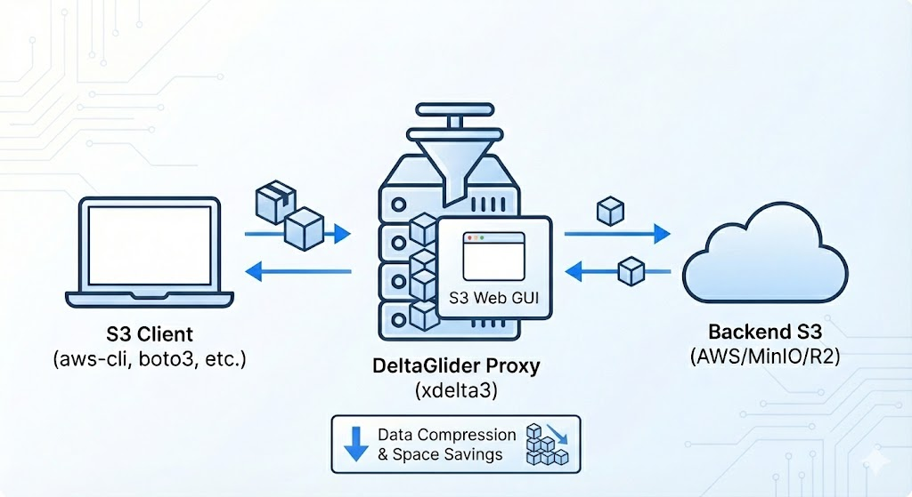
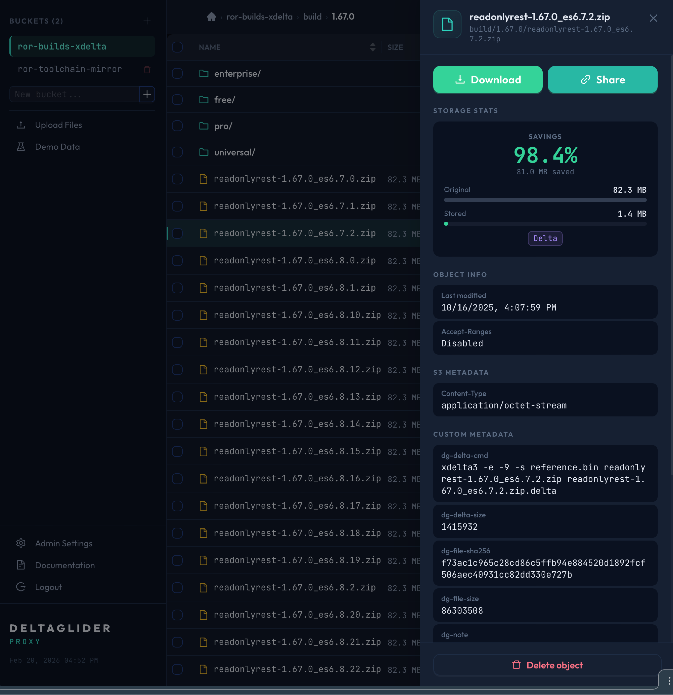

# DeltaGlider Proxy

**Drop-in S3 proxy that delta-compresses versioned binaries. Clients see standard S3. Storage drops 60-95%.**



You store versioned binaries (releases, firmware, ML checkpoints, Docker layers). Each version is 90%+ identical to the last. S3 stores each one in full. You pay for all of it.

DeltaGlider sits between your S3 clients and your storage backend. It intercepts PUTs, computes xdelta3 diffs against a per-prefix baseline, and stores the delta when it's smaller. GETs reconstruct the original on the fly. Your clients never know.

```
PUT releases/v2.zip ──▶ DeltaGlider ──▶ stored as 1.4MB delta (was 82MB)
GET releases/v2.zip ──▶ DeltaGlider ──▶ reconstructed, streamed back as 82MB
```



## Quick start

```bash
# Docker (easiest)
docker run -p 9000:9000 -p 9001:9001 beshutech/deltaglider-proxy

# Or build from source
cd demo/s3-browser/ui && npm ci && npm run build && cd -
cargo build --release
DGP_DATA_DIR=./data ./target/release/deltaglider_proxy
```

Then use it like any S3 endpoint:

```bash
export AWS_ENDPOINT_URL=http://localhost:9000
aws s3 mb s3://builds
aws s3 cp v1.zip s3://builds/releases/v1.zip   # seeds baseline
aws s3 cp v2.zip s3://builds/releases/v2.zip   # stored as delta
aws s3 cp s3://builds/releases/v2.zip ./v2.zip  # full file back, byte-identical
```

A built-in browser UI starts on port 9001 (S3 port + 1). No extra containers.

## How it works

Objects sharing a path prefix form a **deltaspace**. The first upload seeds an internal baseline. Subsequent uploads are stored as xdelta3 diffs when the ratio beats the threshold (default: 50%). Files that don't compress well (images, video, already-compressed formats) pass through untouched.

```
releases/v1.zip  ─┐
releases/v2.zip  ─┼─▶  deltaspace "releases/"
releases/v3.zip  ─┘    baseline: reference.bin (internal)
                        v2.zip.delta: 1.4MB (was 82MB)
                        v3.zip.delta: 0.9MB (was 82MB)
```

**Delta-eligible by default**: `.zip`, `.tar`, `.tgz`, `.tar.gz`, `.tar.bz2`, `.tar.xz`, `.jar`, `.war`, `.ear`, `.rar`, `.7z`, `.dmg`, `.iso`, `.sql`, `.dump`, `.bak`, `.backup`

**Passthrough (skip delta)**: `.jpg`, `.png`, `.mp4`, and other already-compressed formats.

## Storage backends

| Backend | Use case | Config |
|---------|----------|--------|
| **Filesystem** | Local dev, single-node | `DGP_DATA_DIR=./data` |
| **S3/MinIO** | Production, existing infra | `DGP_S3_ENDPOINT=http://minio:9000` |

Metadata lives alongside objects (xattr on filesystem, S3 user-metadata on S3). No external database.

## Configuration

Environment variables (prefix `DGP_`) or TOML config file. Everything has sensible defaults.

```bash
# Core
DGP_LISTEN_ADDR=0.0.0.0:9000       # bind address
DGP_MAX_DELTA_RATIO=0.5             # store delta if ratio < 50%
DGP_MAX_OBJECT_SIZE=104857600       # 100MB cap (xdelta3 constraint)
DGP_CACHE_MB=100                    # reference cache for reconstruction

# Auth (optional — both required to enable SigV4)
DGP_ACCESS_KEY_ID=mykey
DGP_SECRET_ACCESS_KEY=mysecret

# TLS (optional — omit cert/key for auto self-signed)
DGP_TLS_ENABLED=true

# S3 backend
DGP_S3_ENDPOINT=http://localhost:9000
DGP_S3_REGION=us-east-1
DGP_BE_AWS_ACCESS_KEY_ID=backend-key
DGP_BE_AWS_SECRET_ACCESS_KEY=backend-secret
```

Full reference: [deltaglider_proxy.toml.example](deltaglider_proxy.toml.example)

## S3 compatibility

Implements the S3 operations that matter for object storage workloads:

| | Operations |
|-|------------|
| **Objects** | PutObject, GetObject, HeadObject, DeleteObject, CopyObject |
| **Listing** | ListObjectsV2, DeleteObjects (batch) |
| **Buckets** | CreateBucket, HeadBucket, DeleteBucket, ListBuckets |
| **Multipart** | Create, UploadPart, Complete, Abort, ListParts, ListUploads |
| **Auth** | SigV4 header auth, presigned URLs |

Not implemented: versioning, ACLs, lifecycle policies.

## Architecture

~9K lines of Rust. Async throughout (Tokio + axum). No database — state is derived from storage metadata.

```
S3 request
  → SigV4 auth (optional)
  → FileRouter (delta-eligible vs passthrough)
  → DeltaGlider engine (compress / reconstruct / cache)
  → StorageBackend trait (filesystem or S3)
```

- SHA-256 verified on every GET. Corruption detected immediately.
- LRU reference cache for fast reconstruction.
- `x-amz-storage-type` response header exposes strategy (delta/passthrough/reference) for debugging.

## Requirements

- **xdelta3** CLI must be installed (`apt install xdelta3` / `brew install xdelta3`)
- Rust 1.75+ to build from source
- Node.js 18+ to build the demo UI (or use Docker, which handles both)

## Docker

Multi-stage build. UI, Rust compilation, and slim Debian runtime. Multi-arch images published on release.

```bash
docker build -t deltaglider-proxy .
# or
docker compose up -d  # includes MinIO for S3 backend
```

## Docs

- [Operations guide](docs/OPERATIONS.md)
- [Storage format internals](docs/STORAGE_FORMAT.md)
- [Authentication & presigned URLs](docs/AUTHENTICATION.md)
- [Contributing](docs/CONTRIBUTING.md)

## License

[GPLv2](LICENSE)
