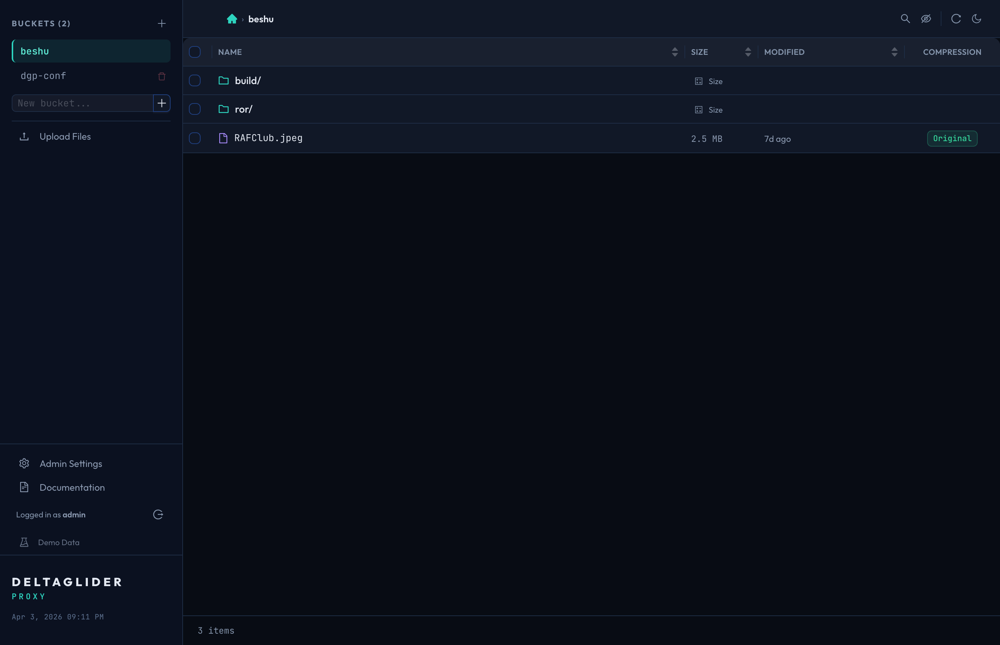
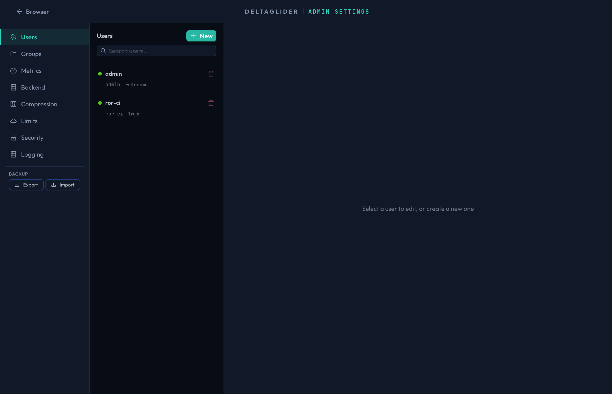

# DeltaGlider Proxy

**S3-compatible proxy with transparent delta compression, multi-user IAM, OAuth login, multi-backend routing, and a built-in admin GUI. Single binary, single port.**

DeltaGlider sits between your S3 clients and your storage backend. Clients see a standard S3 API — no SDK changes, no client awareness. The proxy silently deduplicates versioned binaries using xdelta3, cutting storage 60-95% for workloads like release artifacts, firmware, ML checkpoints, and Docker layers.

```
PUT releases/v2.zip ──▶ DeltaGlider ──▶ stored as 1.4MB delta (was 82MB)
GET releases/v2.zip ──▶ DeltaGlider ──▶ reconstructed, streamed back as 82MB
```



## Features

### Delta Compression
- Transparent xdelta3 encoding on PUT, on-the-fly reconstruction on GET
- Per-prefix deltaspace with automatic baseline management
- SHA-256 verified on every reconstructed GET — corruption detected immediately
- Per-bucket compression policies (enable/disable, custom ratio thresholds)
- Intelligent file routing: archives get delta-compressed, images/video pass through untouched

### Authentication & Access Control
- **SigV4 authentication** — header auth and presigned URLs (up to 7 days)
- **Multi-user IAM** — per-user credentials stored in encrypted SQLCipher database
- **ABAC permissions** — Allow/Deny rules with action verbs (read, write, delete, list, admin), resource patterns (bucket/prefix/*), and AWS-style conditions (s3:prefix, aws:SourceIp)
- **OAuth/OIDC** — Login with Google or any OIDC provider. PKCE, JWT validation, group mapping rules (email domain, glob, regex, claim value)
- **Public prefixes** — Expose specific bucket/prefix paths for unauthenticated read-only access (downloads + listing)
- **Mandatory authentication** — proxy refuses to start without credentials unless explicitly opted out

### Multi-Backend Routing
- Route different buckets to different storage backends (filesystem, S3, mixed)
- Bucket aliasing — map virtual bucket names to real backend buckets
- Hot-reloadable backend configuration via admin GUI

### Admin GUI
Everything managed from a built-in web UI served on the same port as the S3 API (`/_/`):

- **File browser** — navigate, upload, download, preview, bulk copy/move/delete/ZIP
- **User management** — create IAM users, assign permissions, rotate keys, manage groups
- **OAuth configuration** — add providers, configure group mapping rules
- **Storage backends** — add/remove backends, per-bucket routing and compression policies, public prefix configuration
- **Monitoring dashboard** — live Prometheus metrics (request rates, latencies, cache hit rates, status codes, auth events)
- **Storage analytics** — per-bucket savings breakdown, estimated monthly cost savings, compression opportunity detection
- **Embedded documentation** — full-text searchable docs with Mermaid diagrams



### Security
- Per-IP rate limiting with progressive delay and lockout on auth endpoints
- Session IP binding, configurable TTL (default 4h), max 10 concurrent sessions
- SigV4 replay detection (DashMap-based, constant-time signature comparison)
- Clock skew validation (configurable, default 5 minutes)
- Anti-fingerprinting (debug headers off by default)
- Encrypted config database (SQLCipher) with multi-instance S3 sync
- TLS support (optional)

### Performance
- Parallel delta reconstruction (reference + delta fetched concurrently)
- LRU reference cache (moka) for fast reconstruction
- Metadata cache (50MB default) — eliminates repeated HEAD calls
- Lite LIST optimization (no per-object HEAD, ~8x faster)
- Filesystem delimiter optimization (single `read_dir` vs recursive walk)
- Range request passthrough on non-delta objects

## Quick Start

```bash
# Docker (easiest)
docker run -p 9000:9000 beshultd/deltaglider_proxy

# Or build from source
cd demo/s3-browser/ui && npm ci && npm run build && cd -
cargo build --release
./target/release/deltaglider_proxy
```

Then use it like any S3 endpoint:

```bash
export AWS_ENDPOINT_URL=http://localhost:9000
aws s3 mb s3://builds
aws s3 cp v1.zip s3://builds/releases/v1.zip   # seeds baseline
aws s3 cp v2.zip s3://builds/releases/v2.zip   # stored as delta
aws s3 cp s3://builds/releases/v2.zip ./v2.zip  # full file back, byte-identical
```

The admin GUI is at `http://localhost:9000/_/` — same port, no extra containers.

## Storage Backends

| Backend | Use case | Config |
|---------|----------|--------|
| **Filesystem** | Local dev, single-node | `[backend] type = "filesystem"` |
| **S3/MinIO** | Production, existing infra | `[backend] type = "s3"` |
| **Multi-backend** | Route buckets to different backends | `[[backends]]` array |

Metadata lives alongside objects (xattr on filesystem, S3 user-metadata on S3). No external database required for storage — only the optional IAM config uses SQLCipher.

## Configuration

TOML config file or environment variables (`DGP_*` prefix). Everything has sensible defaults.

```toml
listen_addr = "0.0.0.0:9000"
max_delta_ratio = 0.75
authentication = "none"  # remove this line to require SigV4 auth

[backend]
type = "s3"
endpoint = "https://s3.example.com"
region = "us-east-1"

# Per-bucket policies
[buckets.releases]
compression = true
public_prefixes = ["builds/"]   # unauthenticated read access

[buckets.archive]
backend = "cold-storage"        # route to a different backend
alias = "prod-archive-2024"     # real bucket name on that backend
compression = false
```

Full reference: [deltaglider_proxy.toml.example](deltaglider_proxy.toml.example)

## S3 Compatibility

| | Operations |
|-|------------|
| **Objects** | PutObject, GetObject, HeadObject, DeleteObject, CopyObject |
| **Listing** | ListObjectsV2 (start-after, encoding-type, fetch-owner, continuation tokens) |
| **Buckets** | CreateBucket, HeadBucket, DeleteBucket, ListBuckets |
| **Multipart** | Create, UploadPart, Complete, Abort, ListParts, ListUploads |
| **Auth** | SigV4 header auth, presigned URLs (up to 7 days), per-user IAM, OAuth/OIDC |
| **Conditional** | If-Match, If-None-Match (304), If-Modified-Since, If-Unmodified-Since (412) |
| **Range** | Range requests (206 Partial Content) |
| **Validation** | Content-MD5 on PUT/UploadPart |

Not implemented: versioning, lifecycle policies, object lock.

## Architecture

Single Rust binary (~17K lines). Async throughout (Tokio + axum). Single port serves S3 API on `/` and admin UI + APIs under `/_/`.

```
S3 request
  → SigV4 auth / public prefix bypass
  → IAM authorization (ABAC with conditions)
  → FileRouter (delta-eligible vs passthrough)
  → DeltaGlider engine (compress / reconstruct / cache)
  → StorageBackend trait (filesystem, S3, or multi-backend routing)
```

## Docker

Multi-stage build: UI compilation, Rust compilation, slim Debian runtime. Multi-arch images (amd64 + arm64) published on every release.

```bash
docker run -p 9000:9000 beshultd/deltaglider_proxy
```

## Docs

- [How delta reconstruction works](docs/DELTA_RECONSTRUCTION.md)
- [Configuration reference](docs/CONFIGURATION.md)
- [Authentication & IAM](docs/AUTHENTICATION.md)
- [Operations guide](docs/OPERATIONS.md)
- [Storage format internals](docs/STORAGE_FORMAT.md)
- [Metrics & monitoring](docs/METRICS.md)
- [Contributing](docs/CONTRIBUTING.md)

## License

[GPLv2](LICENSE)
