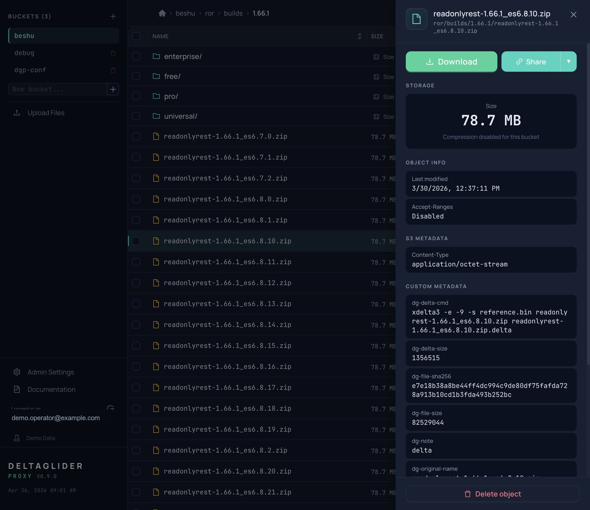
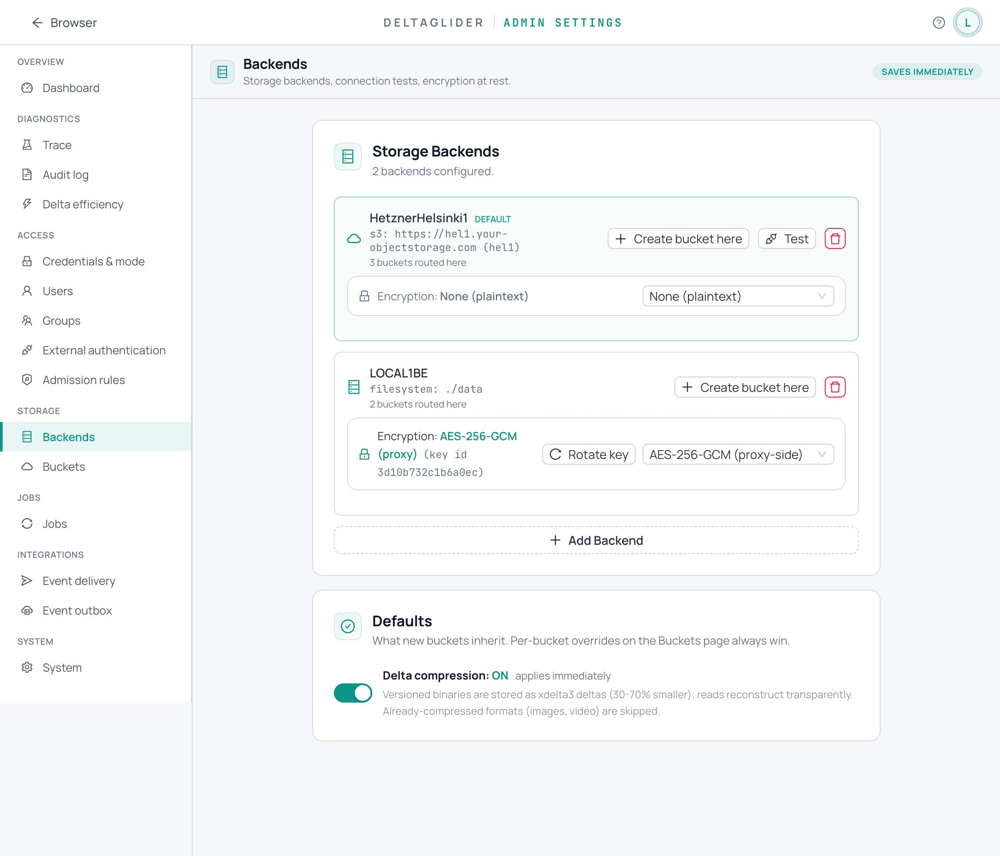
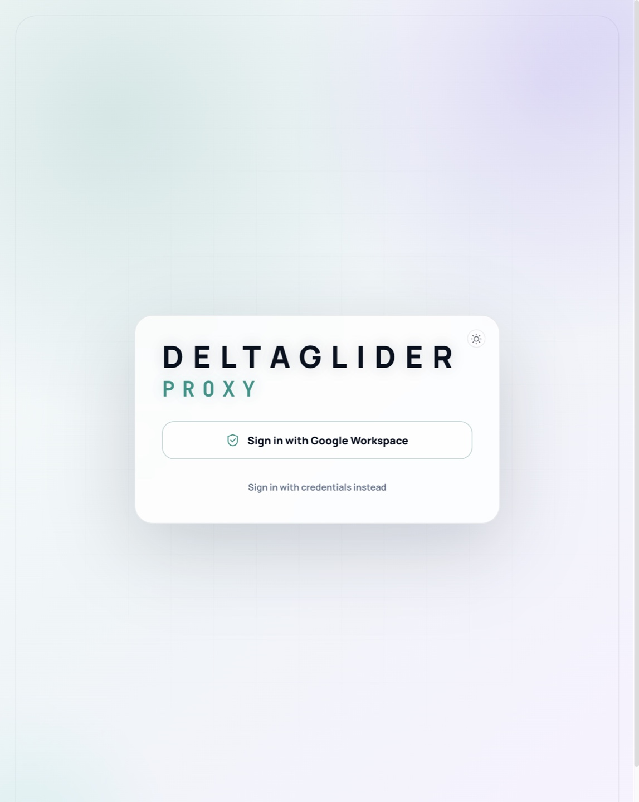
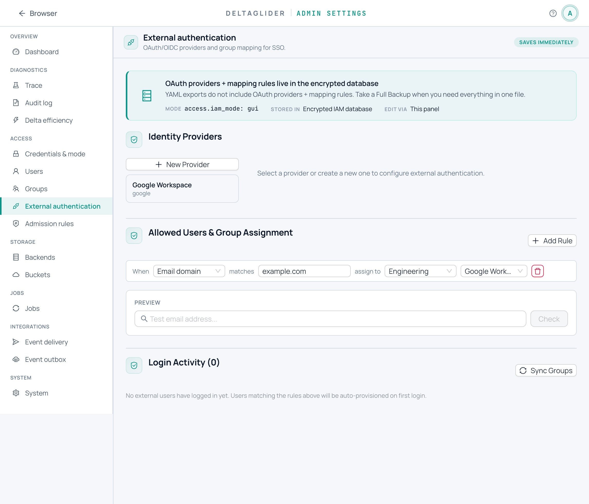
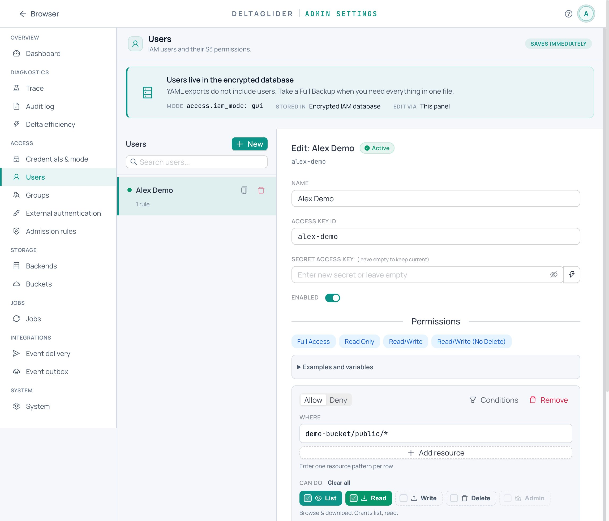
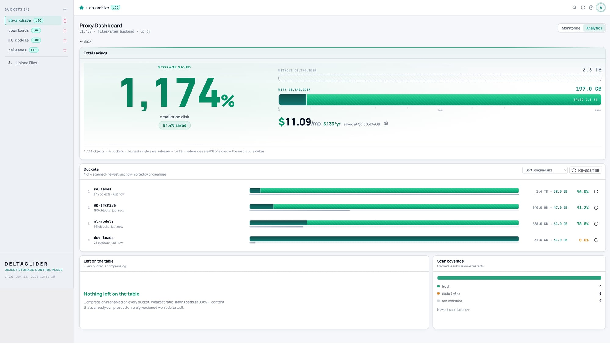
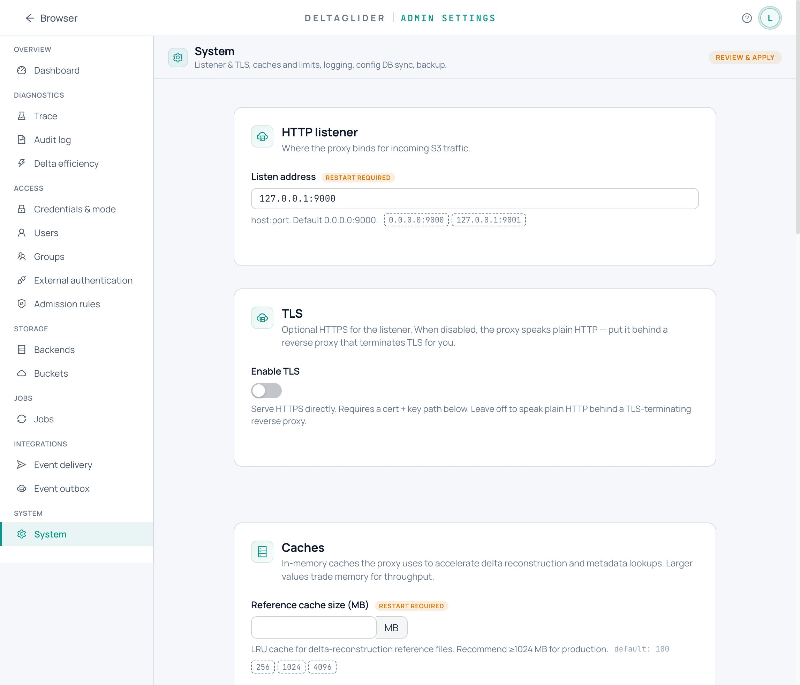

# DeltaGlider Proxy

DeltaGlider is an S3 control plane in front of the storage you already run. It is not an object store or a storage cluster. It routes buckets across existing backends and local filesystems. It adds a centralized admin UI for IAM, OAuth, lifecycle, replication, event outbox delivery, audits, caching, and encryption. It also reduces storage growth for repeated binaries with xdelta3 deltas. It is one binary on one port, and your existing S3 workflows keep working.

## Why DeltaGlider

Organizations run storage across multiple providers: AWS S3, lower-cost S3-compatible SaaS, Hetzner Object Storage, Backblaze B2, MinIO, and local NFS. Each provider has its own credentials, endpoints, and access policies. Teams share credentials in Slack. There is no audit trail and no prefix-level access control, and you cannot publish a folder without exposing the whole bucket.

DeltaGlider Proxy sits in front of all your backends and presents a single, authenticated S3 endpoint. It is the policy, routing, cache, lifecycle, replication, event, audit, encryption, and compression layer that operators usually have to build around an object store:

```
                                          ┌──────────────────────┐
                                     ┌───▶│  AWS S3 (us-east-1)  │
┌──────────────┐    ┌─────────────┐  │    └──────────────────────┘
│  S3 clients  │───▶│ DeltaGlider │──┤    ┌──────────────────────┐
│  (unchanged) │    │    Proxy    │──┼───▶│  Hetzner (Helsinki)  │
└──────────────┘    └─────────────┘  │    └──────────────────────┘
                                     │    ┌──────────────────────┐
                                     └───▶│  Local filesystem    │
                                          └──────────────────────┘
```

Clients see standard S3. They cannot tell which backend stores their bucket, that repeated binaries are stored as deltas, or that objects are encrypted before an untrusted backend sees them. They authenticate once, with corporate SSO if you want, and the proxy handles the rest.



## Core capabilities

### Unified storage gateway



- Multi-backend routing: route each bucket to a different storage backend (AWS S3, Hetzner, Backblaze, MinIO, filesystem), and mix providers behind one endpoint.
- Bucket aliasing and migration: present virtual bucket names to clients and map them to real buckets on the backends. A one-click bucket migration between backends runs as a durable, resumable job that blocks writes while it runs, so you can move providers without changing any client config.
- Single endpoint: clients point at one URL, and the proxy resolves the backend for each bucket transparently.
- Hot reload: add backends, change routing, and update policies from the admin GUI, without a restart.

### Delegated authentication



- OAuth/OIDC single sign-on: your team logs in with Google, Okta, Azure AD, or any OIDC provider, so nobody shares S3 credentials.
- Group mapping rules: assign permissions automatically from the email domain (`*@company.com`), glob patterns, regex, or identity provider claims. New hires get the right access on their first login.


- Multi-user IAM: per-user S3 credentials with ABAC permission rules. Rules Allow or Deny actions (read, write, delete, list) on resource patterns (bucket/prefix/*), with conditions (IP ranges, prefix restrictions).
- SigV4 authentication: full AWS Signature V4 support, including presigned URLs up to 7 days. It works with every S3 SDK and CLI tool.
- Public prefixes: publish specific folders (e.g. release artifacts) for anonymous download without exposing the rest of the bucket. Anonymous access is read-only: it allows no writes and no listing beyond the published prefix.

### Transparent delta compression

- 60-95% storage reduction on repeated binary workloads when the internal structure is similar across versions (backup archives, software catalogs, media/texture variants, AI model variants, release artifacts, firmware, ML checkpoints)
- Clients PUT and GET normally. The proxy intercepts the request, computes an xdelta3 diff against a per-prefix baseline, and stores the delta when it is smaller
- The proxy verifies the SHA-256 on every reconstructed GET, so the result is byte-identical to the original
- Per-bucket compression policies: enable or disable compression per bucket, with custom ratio thresholds
- File routing: the proxy compresses the configurable delta candidates when that saves space. Images, video, and already-compressed formats pass through unchanged

```
PUT releases/v2.zip ──▶ DeltaGlider ──▶ stored as 1.4MB delta (was 82MB)
GET releases/v2.zip ──▶ DeltaGlider ──▶ reconstructed, streamed back as 82MB
```

### Built-in management GUI

You manage everything from a web UI on the same port as the S3 API, without extra containers or infrastructure:

- File browser: navigate, upload, download, and preview files, bulk copy, move, and delete, and download as ZIP
- User management: create IAM users, assign ABAC permissions, rotate keys, and organize users into groups
- OAuth configuration: add identity providers, configure group mapping rules, and test SSO flows
- Backend management: add and remove storage backends, and configure per-bucket routing, aliasing, compression policies, and public prefixes
- Bucket controls: configure soft quotas, read-only bucket freeze, public prefixes, aliases, and compression policy
- Object lifecycle: preview and run expiration and transition/archive rules, with pause/resume, crash-resume, scheduler history/failures, and engine-routed deletes
- Object replication: configure source → destination replication rules from the GUI. Replication is event-driven (mutations replicate in near-real time, and a slow full reconcile catches anything missed), with run-now, pause/resume, history/failures, and delete replication
- One Jobs screen: replication, lifecycle, re-encryption, and migrations in one table with per-job runs, failures, progress, pause/resume, and cancel
- Bucket re-encryption: enable or rotate at-rest encryption, then rewrite the existing objects with a one-off durable job. Writes get 503 SlowDown while the job runs, so no write races the rewrite
- Event outbox and notifications: durable object mutation events with background webhook delivery, fan-out endpoints, retry backoff, and failed-row requeue, all editable in the GUI. Built-in Slack formatting posts object events to a channel through an Incoming Webhook URL or a bot token, with per-bucket/prefix → channel routing
- Monitoring dashboard: live Prometheus metrics for request rates, latencies, cache hit rates, status codes, and auth events
- Storage analytics: per-bucket savings breakdown, estimated monthly cost savings, compression opportunity detection
- Embedded documentation: full-text searchable reference docs with architecture diagrams





### Security



- Mandatory authentication: the proxy refuses to start without credentials, so a deployment cannot be open by accident
- Encrypted config database: the proxy stores IAM users and OAuth config in a SQLCipher-encrypted database, synced across instances through S3
- Proxy-side encryption: AES-256-GCM before data reaches the backend, for low-cost or untrusted S3-compatible storage where the keys must stay in your environment
- Per-IP rate limiting: progressive delay and lockout on auth endpoints, against brute-force attacks
- Session hardening: IP binding, configurable TTL, max concurrent sessions, SameSite/Secure cookies
- SigV4 replay detection: constant-time signature comparison, clock skew validation
- Anti-fingerprinting: server identity headers suppressed by default
- Audit logging: the proxy logs every access with the user, IP, action, and resource
- TLS support: optional, and it auto-detects secure cookies

## Quick start

The proxy refuses to start without credentials, so that a deployment is never open by accident. Supply credentials, or explicitly opt into open access:

```bash
docker run -p 9000:9000 \
  -e DGP_ACCESS_KEY_ID=admin \
  -e DGP_SECRET_ACCESS_KEY=changeme \
  beshultd/deltaglider_proxy
```

Then point any S3 client at `http://localhost:9000`:

```bash
export AWS_ENDPOINT_URL=http://localhost:9000
aws s3 mb s3://builds
aws s3 cp v1.zip s3://builds/releases/v1.zip
aws s3 cp v2.zip s3://builds/releases/v2.zip   # stored as delta
aws s3 cp s3://builds/releases/v2.zip ./v2.zip  # full file back, byte-identical
```

The admin GUI is at `http://localhost:9000/_/`, on the same port, with no setup. On first run, the bootstrap password is auto-generated. The proxy prints it to stderr only when stderr is a terminal (for example with `docker run -it`); otherwise it writes only the hash, to `.deltaglider_bootstrap_hash`. To choose the password, set `DGP_BOOTSTRAP_PASSWORD_HASH` or use the `--set-bootstrap-password` flag.

## Configuration

Configure the proxy with a YAML config file (canonical) or with environment variables (`DGP_*` prefix). A five-line config is enough to run:

```yaml
# deltaglider_proxy.yaml
storage:
  s3: https://s3.example.com
  access_key_id: admin
  secret_access_key: changeme
```

The canonical format has four top-level sections: `admission`, `access`, `storage`, and `advanced`. Each section is optional. Exports omit the fields that equal their defaults, so GitOps diffs stay small.

```yaml
admission:
  blocks:
    - name: deny-bad-ips
      match:
        source_ip_list: ["203.0.113.0/24"]
      action: deny

access:
  access_key_id: admin
  secret_access_key: changeme
  # iam_mode: gui          # (default) encrypted IAM DB is source of truth
  # iam_mode: declarative  # YAML owns IAM; admin-API mutations return 403

storage:
  default_backend: primary
  backends:
    - name: primary
      type: s3
      endpoint: https://s3.us-east-1.amazonaws.com
      region: us-east-1
    - name: europe
      type: s3
      endpoint: https://hel1.your-objectstorage.com
      region: hel1
  buckets:
    releases:
      backend: europe
      compression: true
      public_prefixes: ["builds/", "artifacts/"]
      quota_bytes: 10737418240
    docs-site:
      public: true                  # shorthand for public_prefixes: [""]
    archive:
      backend: primary
      alias: prod-archive-2024
      compression: false

advanced:
  cache_size_mb: 2048
  log_level: deltaglider_proxy=info,tower_http=warn
```

Offline validation: run this before you commit to CI:

```sh
deltaglider_proxy config lint deltaglider_proxy.yaml
```

YAML is the only config format, because v1.4.1 removed TOML support. A `.toml` config makes the proxy fail at startup with an error that says what to do. If you still use TOML, run `deltaglider_proxy config migrate` on v1.4.0 to convert it, then upgrade. See [How to upgrade the proxy](docs/product/how-to/upgrade.md).

Example: [deltaglider_proxy.example.yaml](deltaglider_proxy.example.yaml).

The admin API supports GitOps with full-document apply, per-section PATCH (RFC 7396 merge-patch), JSON Schema export, and an admission-chain trace endpoint. See the [admin API reference](docs/product/reference/admin-api.md).

## S3 compatibility

| | Operations |
|-|------------|
| **Objects** | PutObject, GetObject, HeadObject, DeleteObject, CopyObject |
| **Listing** | ListObjectsV2 (start-after, encoding-type, fetch-owner, continuation tokens) |
| **Buckets** | CreateBucket, HeadBucket, DeleteBucket, ListBuckets |
| **Multipart** | Create, UploadPart, Complete, Abort, ListParts, ListUploads |
| **Auth** | SigV4 header + presigned URLs, per-user IAM, OAuth/OIDC, public prefixes |
| **Conditional** | If-Match, If-None-Match (304), If-Modified-Since, If-Unmodified-Since (412) |
| **Range** | Range requests (206 Partial Content) |
| **Validation** | Content-MD5 on PUT/UploadPart |
| **Lifecycle** | Expiration and transition/archive rules via scheduler, preview, run-now, pause/resume, and history/failures |

Not implemented: versioning, storage-class transitions, object lock.

## Architecture

The proxy is a single Rust binary, async throughout (Tokio and axum). A single port serves the S3 API on `/` and the admin UI and APIs under `/_/`.

```
S3 request
  → SigV4 auth / OAuth session / public prefix bypass
  → IAM authorization (ABAC with conditions)
  → Multi-backend routing (virtual bucket → real backend + bucket)
  → FileRouter (delta-eligible vs passthrough)
  → DeltaGlider engine (compress / reconstruct / cache)
  → StorageBackend (filesystem, S3, or routed)
```

## Docker

Every release publishes multi-arch images (amd64 and arm64):

```bash
docker run -p 9000:9000 beshultd/deltaglider_proxy
```

## Kubernetes / Helm

The chart lives in [`charts/deltaglider-proxy`](charts/deltaglider-proxy):

```bash
helm upgrade --install dgp ./charts/deltaglider-proxy \
  --namespace dgp \
  --create-namespace
```

Port-forward:

```bash
kubectl -n dgp port-forward svc/dgp-deltaglider-proxy 9000:9000
```

Open the admin UI at `http://127.0.0.1:9000/_/`.

The default development bootstrap password is `change-me-in-production`; do not expose that install outside localhost. For production, create a Kubernetes Secret outside Helm with stable `DGP_ACCESS_KEY_ID`, `DGP_SECRET_ACCESS_KEY`, `DGP_BOOTSTRAP_PASSWORD_HASH`, and any backend credentials, then install with:

```bash
helm upgrade --install dgp ./charts/deltaglider-proxy \
  --namespace dgp \
  --create-namespace \
  --set auth.createSecret=false \
  --set auth.existingSecret=deltaglider-secrets
```

The chart mounts the config at `/data/deltaglider_proxy.yaml` so the encrypted IAM DB is created at `/data/deltaglider_config.db` on the PVC. Full guide: [How to deploy on Kubernetes with Helm](docs/product/how-to/deploy-on-kubernetes.md).

### Kubernetes operator (multi-pod)

For deployments with more than one pod, use the official operator in [`operator/`](operator/). It manages the proxy pods and the consistent-hashing router that multi-pod S3 traffic requires. Without that router, multipart uploads fail with `NoSuchUpload` behind a round-robin Service, because the state of an upload lives only on the pod that started it. The operator README states the trade-offs explicitly. Guide: [How to scale out with the Kubernetes operator](docs/product/how-to/scale-out-with-the-kubernetes-operator.md).

## Documentation

**Using an AI assistant?** Give it [llms.txt](https://deltaglider.com/llms.txt)
(an index of every docs page) or [llms-full.txt](https://deltaglider.com/llms-full.txt)
(all docs in one file). Every docs page is also plain markdown at its URL plus
`.md`, for example <https://deltaglider.com/docs/reference/configuration.md>.

Operator-facing docs are also bundled into the running binary at `/_/docs/`. Source files:

The docs follow [Diátaxis](https://diataxis.fr): every page is exactly one of tutorial, how-to, reference, or explanation.

**Tutorials** (guided lessons):
- [Your first delta savings](docs/product/tutorials/first-delta-savings.md): from Docker to visible savings in 15 minutes.
- [Securing your first proxy](docs/product/tutorials/secure-your-proxy.md): your own password, SigV4, and a least-privilege CI user.
- [Your first Helm deployment on kind](docs/product/tutorials/kubernetes-hello-world.md)

**How-to guides** (goal-named recipes): [take a proxy to production](docs/product/how-to/go-to-production.md) · [Docker Compose](docs/product/how-to/deploy-with-docker-compose.md) · [Kubernetes](docs/product/how-to/deploy-on-kubernetes.md) · [Kubernetes operator](docs/product/how-to/scale-out-with-the-kubernetes-operator.md) · [TLS](docs/product/how-to/serve-tls.md) · [upgrade](docs/product/how-to/upgrade.md) · [back up & restore](docs/product/how-to/back-up-and-restore.md) · [HA](docs/product/how-to/run-multiple-instances.md) · [monitor](docs/product/how-to/monitor-with-prometheus.md) · [trace & audit](docs/product/how-to/trace-requests.md) · [troubleshooting](docs/product/how-to/troubleshooting.md) · [route a bucket](docs/product/how-to/route-a-bucket-to-a-backend.md) · [migrate data in](docs/product/how-to/migrate-existing-data-into-the-proxy.md) · [move a bucket](docs/product/how-to/move-a-bucket-between-backends.md) · [compression & quotas](docs/product/how-to/set-bucket-compression-and-quotas.md) · [replicate](docs/product/how-to/replicate-a-bucket.md) · [expire & archive](docs/product/how-to/expire-and-archive-objects.md) · [encrypt](docs/product/how-to/encrypt-data-at-rest.md) · [rotate keys](docs/product/how-to/rotate-encryption-keys.md) · [events](docs/product/how-to/send-event-notifications.md) · [IAM users](docs/product/how-to/create-iam-users.md) · [conditions](docs/product/how-to/restrict-access-with-conditions.md) · [SSO](docs/product/how-to/set-up-sso.md) · [IAM as code](docs/product/how-to/manage-iam-as-code.md) · [admission rules](docs/product/how-to/gate-requests-with-admission-rules.md) · [public folders](docs/product/how-to/publish-a-public-folder.md)

**Reference** (pure facts):
- [Configuration](docs/product/reference/configuration.md) · [CLI](docs/product/reference/cli.md) · [Admin API](docs/product/reference/admin-api.md) · [Authentication](docs/product/reference/authentication.md) · [IAM permissions](docs/product/reference/iam-permissions.md) · [Rate limits](docs/product/reference/rate-limits.md) · [Encryption](docs/product/reference/encryption.md) · [Jobs](docs/product/reference/jobs.md) · [Replication](docs/product/reference/replication.md) · [Lifecycle](docs/product/reference/lifecycle.md) · [Event outbox](docs/product/reference/event-outbox.md) · [Declarative IAM](docs/product/reference/declarative-iam.md) · [Metrics](docs/product/reference/metrics.md)

**Concepts** (how it works and why):
- [Delta compression](docs/product/explanation/delta-compression.md) · [Multi-backend routing](docs/product/explanation/multi-backend-architecture.md) · [The security model](docs/product/explanation/security-model.md) · [Encryption at rest](docs/product/explanation/encryption-at-rest.md) · [Jobs & durability](docs/product/explanation/jobs-and-durability.md)

Plus the [FAQ index](docs/product/faq.md).

**Contributor-only** (not in the binary):
- [Contributing](docs/dev/contributing.md) · [Releasing](docs/dev/releasing.md) · [CI infrastructure](docs/dev/ci-infra.md) · [Historical design docs](docs/dev/historical/)

## License

[Business Source License 1.1](LICENSE) (BUSL-1.1). In plain terms:

- Free for most users. Production use is free as long as your
  organization's stored footprint stays at or under 15 TB. The stored
  footprint counts every copy that DeltaGlider writes, after compression,
  including replicas and archives, and it is measured as a monthly
  average. Copies that your storage provider keeps for its own redundancy
  do not count. Development, testing, and evaluation are always free, at
  any size. There are no license keys and no locked features. The license
  is a legal term, and the software does not enforce it technically.
- Every release becomes open source. Two years after each version
  is released, that version automatically converts to the
  [Apache License 2.0](https://www.apache.org/licenses/LICENSE-2.0).
- Larger organizations need a commercial license. Above 15 TB, the
  Commercial plan is priced per organization and covers any number of
  instances, clusters, and regions up to 1 PB. Above 1 PB, or for custom
  terms, there is an Enterprise plan. Offering DeltaGlider to third
  parties as a hosted service, or shipping it inside a commercial product
  or appliance, needs an OEM license. See
  [deltaglider.com/pricing](https://deltaglider.com/pricing/).
- Older releases keep their terms. Every release up to and including
  v1.17.0 was published under GPL-3.0 and remains under GPL-3.0
  forever. Releases v1.18.x and v1.19.x keep the grant text that they
  shipped with.

Contributors must sign the [Contributor License Agreement](CLA.md),
which assigns copyright to Beshu Limited so the project can be licensed
this way. A bot will prompt you to sign on your first pull request.
