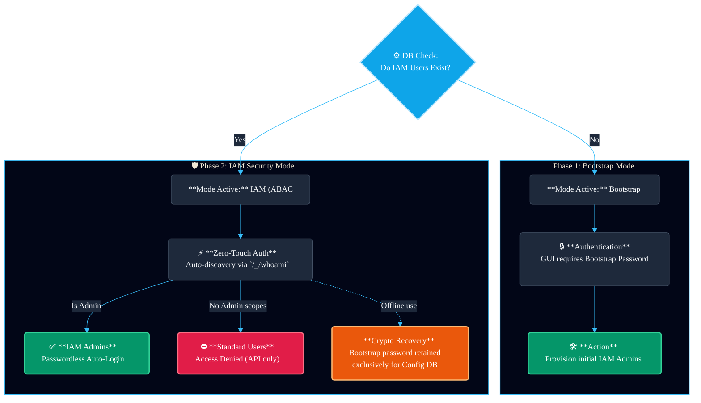

# Authentication

DeltaGlider Proxy supports AWS Signature Version 4 (SigV4) authentication with two operational modes: **bootstrap mode** (single credential pair) and **IAM mode** (per-user credentials with attribute-based access control).

## Auth Modes

### Bootstrap Mode (default on fresh install)

A single S3 credential pair is configured via TOML or environment variables. All clients share the same credentials. Admin GUI access requires the **bootstrap password**.

```bash
# S3 credentials (client-to-proxy)
export DGP_ACCESS_KEY_ID=myaccesskey
export DGP_SECRET_ACCESS_KEY=mysecretkey
```

### IAM Mode (activates when IAM users exist)

Per-user credentials stored in an encrypted SQLCipher database (`deltaglider_config.db`). Each user has their own access key, secret key, and permission rules. Admin GUI access is permission-based — IAM admins don't need a password.

IAM mode activates automatically when the first IAM user is created via the admin GUI. The bootstrap credentials are migrated as a "legacy-admin" user.

### Open Access

When no credentials are configured, the proxy operates without authentication.

## Bootstrap Password

A single infrastructure secret that serves three purposes:

1. **Encrypts the config database** — IAM users are stored in SQLCipher, encrypted with the bcrypt hash of this password
2. **Signs admin session cookies** — HMAC-based session authentication for the admin GUI
3. **Gates admin GUI access** — In bootstrap mode (before IAM users exist), this password is required to access settings

### Lifecycle

- **Auto-generated** on first run if not set (printed to stderr, hash saved to `.deltaglider_bootstrap_hash`)
- **Set explicitly** via `DGP_BOOTSTRAP_PASSWORD_HASH` env var or `bootstrap_password_hash` in TOML
- **Reset** via `--set-bootstrap-password` CLI flag

> **Warning**: Resetting the bootstrap password invalidates the encrypted IAM database. All IAM users will be lost on next restart.

### Backward Compatibility

| New | Old (deprecated alias) |
|-----|------------------------|
| `DGP_BOOTSTRAP_PASSWORD_HASH` | `DGP_ADMIN_PASSWORD_HASH` |
| `bootstrap_password_hash` (TOML) | `admin_password_hash` |
| `--set-bootstrap-password` | `--set-admin-password` |
| `.deltaglider_bootstrap_hash` | `.deltaglider_admin_hash` (read as fallback) |

## IAM Permissions (ABAC)

Each IAM user has one or more permission rules:

```json
{
  "actions": ["read", "write", "delete", "list"],
  "resources": ["mybucket/*"]
}
```

### Actions

| Action | S3 Operations |
|--------|---------------|
| `read` | GetObject, HeadObject |
| `write` | PutObject, CopyObject, CreateMultipartUpload, UploadPart, CompleteMultipartUpload |
| `delete` | DeleteObject, DeleteObjects |
| `list` | ListBuckets, ListObjectsV2, ListMultipartUploads, ListParts |
| `admin` | Admin GUI access |
| `*` | All actions |

### Resources

Glob patterns matching `bucket/key`:
- `*` — all buckets and keys (full admin)
- `mybucket/*` — all keys in `mybucket`
- `mybucket/releases/*` — keys under `releases/` prefix

A user is considered an **admin** when they have both wildcard actions (`*` or `admin`) AND wildcard resources (`*`).

## Admin GUI Access Flow



## SigV4 Verification

The proxy verifies SigV4 signatures from two sources:

| Path | Source | Use case |
|------|--------|----------|
| **Header auth** | `Authorization: AWS4-HMAC-SHA256 ...` header | Standard S3 SDK calls (aws-cli, boto3, etc.) |
| **Presigned URL** | `X-Amz-Algorithm`, `X-Amz-Credential`, `X-Amz-Signature` query parameters | Browser downloads, shareable links |

Both paths extract the access key ID, look up the user (bootstrap: single credential; IAM: lookup by access key in IamIndex), and verify the HMAC-SHA256 signature against the user's secret key.

### Verify-Then-Re-sign

SigV4 signatures are bound to the Host header and URI path. The proxy's host/port differs from upstream S3, and internal storage paths (deltaspaces, references, deltas) differ from the logical keys clients use.

The proxy cannot forward the client's signature — it verifies it, discards it, and makes its own authenticated requests to the backend using the AWS SDK (which signs automatically with the backend credentials).

## S3 Backend Credentials

When using the S3 backend, the proxy needs two credential sets:

1. **Proxy credentials** — for client-to-proxy auth (bootstrap or per-user IAM)
2. **Backend credentials** — for proxy-to-upstream-S3 auth

```bash
# Backend auth (proxy → upstream S3/MinIO)
export DGP_BE_AWS_ACCESS_KEY_ID=minioadmin
export DGP_BE_AWS_SECRET_ACCESS_KEY=minioadmin
export DGP_S3_ENDPOINT=http://localhost:9000
```

## Using with S3 Tools

### aws-cli

```bash
export AWS_ACCESS_KEY_ID=myaccesskey
export AWS_SECRET_ACCESS_KEY=mysecretkey
export AWS_DEFAULT_REGION=us-east-1

aws --endpoint-url http://localhost:9000 s3 cp file.zip s3://mybucket/file.zip
aws --endpoint-url http://localhost:9000 s3 ls s3://mybucket/
aws --endpoint-url http://localhost:9000 s3 presign s3://mybucket/file.zip --expires-in 3600
```

### boto3 (Python)

```python
import boto3

s3 = boto3.client(
    's3',
    endpoint_url='http://localhost:9000',
    aws_access_key_id='myaccesskey',
    aws_secret_access_key='mysecretkey',
    region_name='us-east-1',
)

s3.upload_file('file.zip', 'mybucket', 'file.zip')
url = s3.generate_presigned_url(
    'get_object',
    Params={'Bucket': 'mybucket', 'Key': 'file.zip'},
    ExpiresIn=3600,
)
```

## Error Responses

| Error Code | HTTP Status | Cause |
|---|---|---|
| `AccessDenied` | 403 | Missing credentials, access key mismatch, expired presigned URL, or insufficient permissions |
| `SignatureDoesNotMatch` | 403 | Signature verification failed |
| `RequestTimeTooSkewed` | 403 | Client clock differs from server by more than 15 minutes |
| `InvalidArgument` | 400 | Malformed Authorization header or unparseable date/expiry values |

All errors are returned as standard S3 XML error responses.

## Security Considerations

- **Use HTTPS in production**: SigV4 authenticates but does not encrypt. Use a TLS-terminating reverse proxy or enable DeltaGlider's built-in TLS.
- **Bootstrap password security**: The bootstrap password encrypts the IAM database. Treat it like a master key. Store it securely.
- **Credential rotation**: IAM user keys can be rotated via the admin GUI without downtime.
- **Presigned URL expiration**: Generate short-lived URLs when possible. Expiration is enforced server-side.
- **Region**: The proxy accepts any region in the credential scope. Standard S3 tools default to `us-east-1`.
