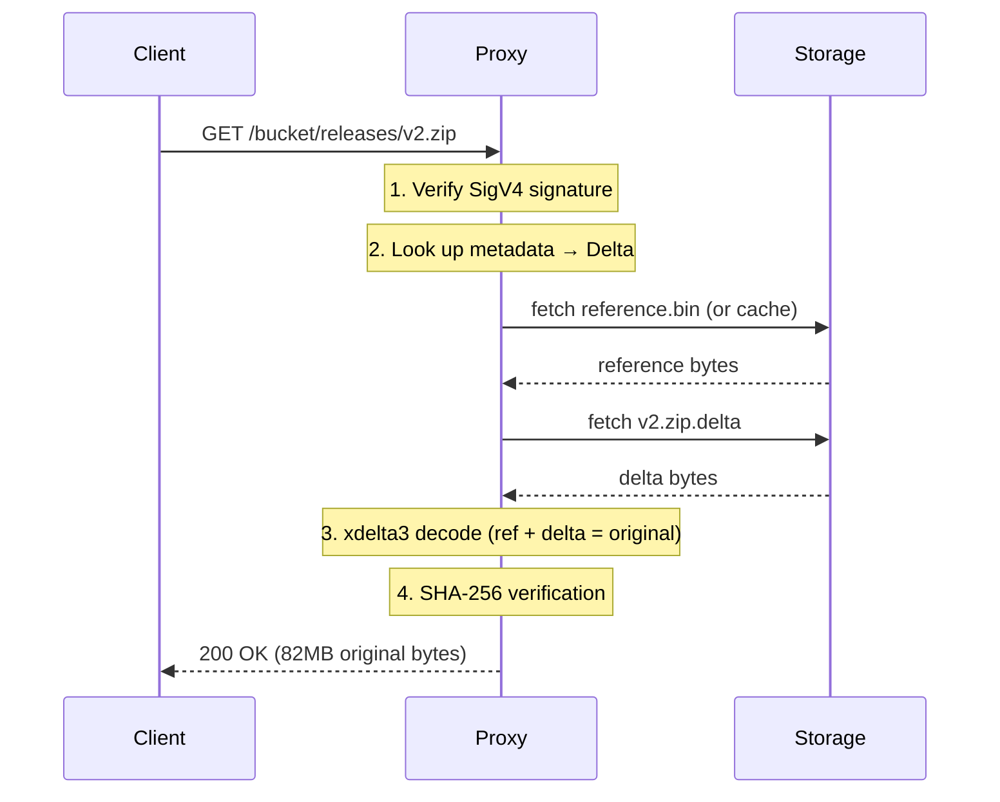

# Delta Reconstruction

*How GET reconstructs files from reference + delta*

When a client downloads a delta-compressed file, the proxy transparently reconstructs the original on the fly. The client receives the exact bytes it uploaded — it never sees deltas.

## The Flow

## What the Client Sees

The response is **indistinguishable from a standard S3 GET**:

| Header | Value | Notes |
|--------|-------|-------|
| `Content-Length` | Original file size (82MB) | Not the delta size (1.4MB) |
| `ETag` | Hash of original file | Standard S3 ETag format |
| `Content-Type` | From original PUT | Preserved exactly |
| `Last-Modified` | Upload timestamp | Standard HTTP format |
| `x-amz-meta-*` | User metadata from PUT | All custom metadata preserved |

The only hint that delta compression occurred is `x-amz-storage-type: delta` — a custom debug header that standard S3 clients ignore.

## Streaming vs Buffering

| Storage type | Memory usage | Behavior |
|-------------|-------------|----------|
| **Passthrough** | Constant (chunk-based) | Streamed directly from backend — zero-copy |
| **Delta** | O(file_size) | Buffered in memory — xdelta3 needs the full reference + delta to reconstruct |
| **Reference** | O(file_size) | Buffered (same as delta) |

Delta reconstruction requires buffering because xdelta3 is a batch algorithm — it cannot stream output incrementally. This is why `max_object_size` (default 100MB) exists: it caps the memory used for reconstruction.

The reference file is cached in an LRU cache (`cache_size_mb`, default 100MB) to avoid re-reading it from storage for every GET in the same deltaspace.

## Integrity Verification

Every delta-reconstructed file is verified before being sent to the client:

1. At **PUT time**: SHA-256 is computed on the original data and stored in metadata
2. At **GET time**: SHA-256 is computed on the reconstructed data and compared to the stored hash
3. On **mismatch**: The cached reference is evicted and a `500 InternalError` is returned — prevents serving corrupt data

Passthrough files are streamed directly without SHA-256 verification (constant-memory streaming is incompatible with buffered hash computation). Storage-level integrity (filesystem checksums, S3's built-in integrity) protects these.

## Presigned URLs

Presigned GET URLs work identically. The proxy verifies the presigned signature (including expiration), then reconstructs the delta internally. The signed URL never reaches the backend — the proxy makes its own authenticated request to storage.

See [Authentication](AUTHENTICATION.md) for the full presigned URL flow.
