# Migrate from TOML to YAML Configuration

*A step-by-step guide from legacy `deltaglider_proxy.toml` to the
canonical four-section YAML format.*

TOML config still loads, but the server now emits a deprecation
warning on every startup and TOML will be removed in a future minor
release. Operators have a grace period of two minor versions to
migrate. This guide walks through the conversion.

## Prerequisites

- A working `deltaglider_proxy.toml` (or equivalent) you want to
  convert.
- The `deltaglider_proxy` CLI available locally
  (`cargo build --release` or a prebuilt binary).
- Read access to your current config file.

---

## TL;DR — the one-liner

```sh
deltaglider_proxy config migrate \
    /etc/deltaglider/deltaglider_proxy.toml \
    --out /etc/deltaglider/deltaglider_proxy.yaml
```

Point the server at the new file (`--config` flag or `DGP_CONFIG`
env var), restart, done. Silence the legacy warning on stragglers
with `DGP_SILENCE_TOML_DEPRECATION=1` while you roll out.

If you only have a running server (no TOML file), fetch the current
config over the admin API:

```sh
# Full document (every section):
curl -b session-cookie \
    http://localhost:9000/_/api/admin/config/export > deltaglider_proxy.yaml

# One section at a time (e.g. just Storage):
curl -b session-cookie \
    'http://localhost:9000/_/api/admin/config/export?section=storage' > storage.yaml
```

Both paths redact every secret — the output is safe to commit to a
GitOps repo. You re-inject credentials via env vars at deploy time.

Alternatively, use the admin GUI's **Export all YAML** action in the
right-rail on any Configuration page (Admission / Access / Storage /
Advanced → **Export all**).

The rest of this guide explains **why** the format changed, **what**
each section means, and how the `S3-synced IAM database` fits into
the new picture.

---

## Why the change

Phase 3 of the config refactor split a flat TOML bag of ~35 fields
into four semantic sections, each with its own composition rule:

| Section     | Concern                                             |
|-------------|-----------------------------------------------------|
| `admission` | Pre-auth request gating — deny / reject / allow     |
| `access`    | Credentials + IAM source-of-truth mode              |
| `storage`   | Backend(s) and per-bucket overrides                 |
| `advanced`  | Listener, caches, TLS, log level, infra secrets     |

Shorthand forms auto-expand so a five-line config runs:

```yaml
storage:
  s3: https://s3.example.com
  access_key_id: admin
  secret_access_key: changeme
```

Operator-authored admission blocks (IP denylists, maintenance
mode) are **first-class** in YAML — TOML cannot serialize them
cleanly, which is the proximate reason TOML is being deprecated.

---

## Step 1: Run the migrator

The `config migrate` subcommand reads any supported format (TOML,
YAML) and emits canonical YAML on stdout or to a file:

```sh
deltaglider_proxy config migrate deltaglider_proxy.toml \
    --out deltaglider_proxy.yaml
```

**What it does:**
- Parses the TOML into the in-memory `Config` struct.
- Serializes back out via `to_canonical_yaml`, which:
  - Emits the sectioned shape.
  - Omits default-valued sections entirely (cleaner diff).
  - Strips infra secrets — the bootstrap password hash and AES
    encryption key are **never** written to disk artifacts.

**What it preserves verbatim:** SigV4 credentials, backend
endpoints, per-bucket policies, quotas, rate-limit tuning, cache
sizing, TLS cert paths.

**What it does NOT preserve:** infra secrets (stripped). You must
re-supply `bootstrap_password_hash` and `encryption_key` via env
vars or a downstream secret-manager injection.

---

## Step 2: Inspect the output

Open the generated YAML. A typical migrated config looks like:

```yaml
access:
  access_key_id: admin
  secret_access_key: changeme
storage:
  backend:
    type: s3
    endpoint: https://s3.example.com
    region: us-east-1
    force_path_style: true
  buckets:
    releases:
      public_prefixes:
        - builds/
      compression: true
advanced:
  listen_addr: 0.0.0.0:9000
  cache_size_mb: 2048
  config_sync_bucket: my-config-sync-bucket
```

**Things worth a second look:**

1. **Backend shape.** The migrator emits the long form
   (`backend: { type: s3, ... }`). If you want the five-line
   shorthand, collapse it by hand:

   ```yaml
   storage:
     s3: https://s3.example.com
     region: us-east-1
     access_key_id: admin
     secret_access_key: changeme
   ```

   Both forms are equivalent; the shorthand is purely ergonomic.

2. **Public buckets.** If a bucket's `public_prefixes: [""]`
   (empty-string sentinel for "entire bucket"), the canonical
   exporter collapses it to `public: true`:

   ```yaml
   buckets:
     docs-site:
       public: true
   ```

   Use whichever form you prefer — the loader accepts both.

3. **Missing sections.** If `access` / `admission` / `advanced` are
   absent, they're all at their defaults. This is intentional
   — GitOps diffs stay small.

---

## Step 3: Validate before applying

Run `config lint` to catch any shape, semantic, or
deprecation-warning issues offline — this is what you should wire
into CI:

```sh
deltaglider_proxy config lint deltaglider_proxy.yaml
```

Exit codes:

| Code | Meaning                                         |
|------|-------------------------------------------------|
| 0    | Valid (warnings may appear on stderr)           |
| 3    | I/O error (file not found, unreadable)          |
| 4    | Parse error (bad YAML, unknown field, bad IP)   |
| 6    | Validation error (duplicate block name, etc.)   |

Lint runs the exact same pipeline as the admin API's
`/config/validate` endpoint, so a green lint guarantees
`/config/apply` will accept the file (subject to runtime
concerns like a reachable backend).

---

## Step 4: Point the server at the new file

**Option A — explicit `--config` flag** (recommended for GitOps):

```sh
deltaglider_proxy --config /etc/deltaglider/deltaglider_proxy.yaml
```

**Option B — `DGP_CONFIG` env var** (container-friendly):

```sh
export DGP_CONFIG=/etc/deltaglider/deltaglider_proxy.yaml
deltaglider_proxy
```

**Option C — default search path**: drop the file at one of the
well-known paths (`./deltaglider_proxy.yaml`, `/etc/deltaglider/deltaglider_proxy.yaml`).

Restart the server. Watch the startup log — you should see no
deprecation warning. If you still see the TOML warning, the server
is loading the old `.toml` file; double-check the config path.

---

## Step 5: Feed secrets back in

Secrets don't round-trip through `config migrate` (by design —
artifacts shouldn't carry them). Inject them out-of-band:

| Secret                    | Env var                                      |
|---------------------------|----------------------------------------------|
| Bootstrap password (hash) | `DGP_BOOTSTRAP_PASSWORD_HASH`                |
| Bootstrap password (raw)  | `DGP_BOOTSTRAP_PASSWORD` (hashed on startup) |
| AES-256 master key        | `DGP_ENCRYPTION_KEY`                         |
| Backend S3 access key     | `DGP_BE_AWS_ACCESS_KEY_ID`                   |
| Backend S3 secret         | `DGP_BE_AWS_SECRET_ACCESS_KEY`               |

Env vars always override file content — this is the
Docker/Kubernetes-friendly path. Your CI/CD secret store should
inject the env vars; the YAML file never touches them.

---

## The new role of the S3-synced IAM database

One thing the migration does **not** change: the encrypted IAM
database (`deltaglider_config.db`, SQLCipher) still stores IAM
users, groups, OAuth/OIDC providers, and group mapping rules. Its
`DGP_CONFIG_SYNC_BUCKET` multi-instance sync mechanism still works
exactly as before.

What **did** change is the mental model of where it sits in the
overall config story.

### Before (Phase 2 and earlier)

The SQLCipher DB was the only way to carry IAM state — users and
groups existed there and nowhere else. The TOML file held
everything non-IAM. There was no distinction in the config layout
between "YAML-managed" and "DB-managed".

```mermaid
graph LR
    TOML["deltaglider_proxy.toml<br/>(everything except IAM users)"]
    DB["deltaglider_config.db<br/>(IAM users + groups + OIDC)"]
    S3["S3 bucket<br/>(DGP_CONFIG_SYNC_BUCKET)"]

    TOML --> SERVER["deltaglider_proxy"]
    DB --> SERVER
    DB -- "upload after mutation" --> S3
    S3 -- "download if newer" --> DB

    style TOML fill:#3a2a1a,stroke:#d97706
    style DB fill:#1a3a2a,stroke:#2dd4bf
```



### After (Phase 3c and later)

The new `access.iam_mode` selector makes the relationship explicit:

```yaml
access:
  iam_mode: gui          # (default) DB is source of truth
  # iam_mode: declarative  # YAML is source of truth
```

#### `iam_mode: gui` (default)

**The SQLCipher DB remains authoritative for IAM state.**

- Admin GUI / admin-API user + group + OIDC CRUD writes to the DB.
- S3 sync still works — every mutation uploads the DB to
  `s3://<DGP_CONFIG_SYNC_BUCKET>/.deltaglider/config.db`. Every
  5 minutes the server polls the S3 ETag and downloads if newer.
- The YAML `access:` section holds the **legacy SigV4 credential
  pair** only (the bootstrap admin key used before IAM users
  exist, plus the `access.authentication` selector).
- YAML changes to credentials still hot-reload via
  `/api/admin/config/apply`.

Nothing about the S3-synced DB has changed. It remains the
multi-instance sync mechanism for IAM state, and the
`DGP_CONFIG_SYNC_BUCKET` env var / `advanced.config_sync_bucket`
YAML key continues to enable it.

#### `iam_mode: declarative` (opt-in, Phase 3c.2)

**The YAML document becomes authoritative for IAM routes.**

- Admin API IAM mutation routes (`POST/PUT/PATCH/DELETE` on
  `/users`, `/groups`, `/ext-auth/providers`, `/ext-auth/mappings`,
  `/migrate`, backup import) return `403 Forbidden` with
  `{"error": "iam_declarative"}` and a pointer to
  `/api/admin/config/apply`.
- Read endpoints (`GET /users`, `GET /groups`) stay accessible so
  the GUI can still display DB state for diagnostics.
- The S3 sync mechanism **keeps running** — the DB is still the
  runtime lookup structure the SigV4 verifier consults. You just
  can't mutate it through the GUI.
- **What's deferred:** the reconciler that sync-diffs the DB to
  YAML (Phase 3c.3). Until that lands, declarative mode provides
  a pure **lockout**: GUI can't edit IAM, and YAML `access.users`
  arrays aren't yet consumed. Operators adopting declarative
  today either:
  - Start with an empty DB and seed IAM state via a
    one-time `iam_mode: gui` admin-API session, then flip to
    declarative, OR
  - Import from an existing DB via the S3 sync mechanism, then
    flip to declarative.

### When to use which

| Your setup                                | Pick        | Why                                                       |
|-------------------------------------------|-------------|-----------------------------------------------------------|
| Solo operator, admin GUI, occasional edits| `gui`       | Zero friction; the GUI is the authoring surface           |
| GitOps pipeline owns IAM                  | `declarative`| YAML is reviewed in PRs; runtime GUI edits are blocked   |
| Multi-instance deployment (K8s, ASG)      | Either      | S3 sync handles the multi-instance consistency regardless |
| Hybrid: GitOps for prod, GUI for dev      | `gui` + `declarative` per environment | Same YAML schema; different mode setting              |

### Mode transitions are audit-logged

Every `iam_mode` flip (either direction) fires a warn-level
tracing line:

```
WARN [config] access.iam_mode changed: Gui → Declarative. In declarative mode
the admin-API IAM mutation routes return 403; a flip to `gui` restores them.
Review the subsequent apply_config audit log entries to see what mutations
followed.
```

Pipe your log aggregator at `deltaglider_proxy::config` target to
surface the declarative "escape hatch" pattern (flip to gui,
mutate, flip back) to security auditors.

---

## Common gotchas

### "My TOML had a `[buckets.foo]` table header"

YAML doesn't use `[table]` headers — all bucket policies nest
under `storage.buckets`. The migrator handles this automatically;
you only need to know it when hand-editing.

### "I can't persist a YAML-only field to a TOML target"

As of the deep correctness review, `persist_to_file` refuses to
write operator-authored admission blocks or `iam_mode:
declarative` to a TOML target. The error tells you exactly what
to do:

```
cannot persist runtime config to `/etc/dgp/config.toml` (TOML): the in-memory
config holds YAML-only fields (admission.blocks). Convert the target file to
YAML first — run `deltaglider_proxy config migrate /etc/dgp/config.toml --out
/etc/dgp/config.yaml` — and point the server at the new file, then re-apply.
```

This is not a bug — it's a guard against the worst failure mode
(silent half-persist: live runtime updated, on-disk file missing
the new fields, next restart silently reverts).

### "Env var overrides still work"

Yes. `DGP_*` env vars continue to override everything. This is
the container-friendly deployment pattern and hasn't changed.

### "What about `deltaglider_proxy_secrets.env`?"

If you were using a sibling `.env` file for secrets (e.g. the
output of `examples/scrape_full_config`), keep using it the same
way. YAML + env var injection is the same contract as TOML + env
var injection.

---

## Verification checklist

After migration, confirm:

- [ ] Server starts without the TOML deprecation warning.
- [ ] `curl http://localhost:9000/_/health` returns 200.
- [ ] `curl -b session http://localhost:9000/_/api/admin/config/export`
      returns a valid YAML document.
- [ ] `deltaglider_proxy config lint <your.yaml>` exits 0.
- [ ] Existing S3 clients still authenticate and list/get objects.
- [ ] The admin GUI at `http://localhost:9000/_/` still shows your
      existing IAM users (DB is untouched by the migration).
- [ ] If you set `config_sync_bucket`, the S3-synced DB key
      `s3://<bucket>/.deltaglider/config.db` is still getting
      updated after IAM mutations.

---

## Related documentation

- [CONFIGURATION.md](CONFIGURATION.md) — full field reference
- [OPERATIONS.md](OPERATIONS.md#admin-api-endpoints) — admin API endpoint catalog (GitOps surfaces, section-level merge-patch, trace)
- [AUTHENTICATION.md](AUTHENTICATION.md) — SigV4 + bootstrap + IAM modes
- [HOWTO_SECURITY_BASICS.md](HOWTO_SECURITY_BASICS.md) — recommended secure defaults
- [docs/plan/progressive-config-refactor.md](plan/progressive-config-refactor.md) — design rationale
