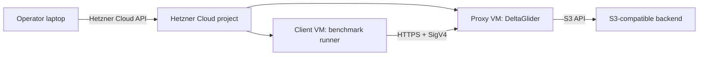

# Compression tax benchmark

This benchmark compares **passthrough** (baseline) against **compression**, **encryption**, and **both** on the **same** artifact set and bucket layout.

### What to measure (minimal)

| Question | Where it shows |
|----------|----------------|
| Upload slowdown vs baseline | Per-mode **PUT** wall MB/s (`mb_s_wall` in `summary.json`) |
| Cold vs warm download slowdown | **cold_get** vs **warm_get** vs passthrough |
| Extra CPU / RAM vs baseline | Resource rollup / timeseries (`/_/health` RSS, Docker CPU%, optional host JSON) |
| “Whole ISO in RAM?” | Compare **peak RSS** to largest artifact size (sanity check, not SLO) |

**Out of scope unless you opt in:** concurrency sweeps (`--concurrency 1,4`), multi-trial statistics, load testing. Default **`run` concurrency is `1`**.

**Prometheus Δ saved** is optional for this narrative—focus on **transfer time + resources** first.

**Relative slowdown vs passthrough** (same phase: PUT, cold_get, or warm_get):  
`100 * (1 - mode_mb_s_wall / passthrough_mb_s_wall)` — use `mb_s_wall` from `summary.json` → `modes` → `<mode>` → `c1` → `<phase>` (same for **report.md** after the run).

### Primary scenario

Use a CI artifact publishing workflow inside Hetzner Cloud:



The main measurement should be Hetzner-local. Do not use home internet as the
primary result; home-to-Hetzner measures ISP and WAN jitter.

## What is tested

The same dataset is run through four modes:

| Mode | Compression | Proxy AES-GCM | Purpose |
|---|---:|---:|---|
| `passthrough` | off | off | Proxy baseline |
| `compression` | on | off | xdelta3 tax |
| `encryption` | off | on | local-key encryption tax |
| `compression_encryption` | on | on | regulated / cheap-S3 mode |

Use the same backend for every mode. Create separate buckets for the modes and
configure their policies/backends accordingly.

## Dataset

The primary dataset is real public artifacts, not generated random data.

Recommended primary track: contiguous Alpine `virt` ISO releases (small, public,
version-adjacent):

```text
alpine-virt-3.19.0-x86_64.iso
alpine-virt-3.19.1-x86_64.iso
alpine-virt-3.19.2-x86_64.iso
alpine-virt-3.19.3-x86_64.iso
alpine-virt-3.19.4-x86_64.iso
```

Kernel `.tar.xz` should be treated as a negative-control profile, not the
default publication profile.

**Enough for comparative answers** (what you actually need): a handful of similar ISOs on one prefix (e.g. **5 × ~60 MB**). Everything below is optional publication-scale bulk.

Recommended shape (large runs / publication only):

- 20-50 artifacts
- 100-300 MB each
- same prefix/deltaspace
- 2-10 GB total original bytes

## Install

On the machine that will orchestrate the benchmark:

```bash
python3 -m venv .venv-dgp-bench
. .venv-dgp-bench/bin/activate
pip install -r docs/benchmark/requirements.txt
```

The runner itself uses only stdlib for S3/SigV4 operations. The `hcloud`
dependency is needed only for `up`, `status`, and `down`.

The executable entrypoint is intentionally tiny:

```text
docs/benchmark/bench_production_tax.py
```

Most implementation lives in `docs/benchmark/dgp_bench/`:

- `cli.py` — command routing and argument parsing
- `hcloud_lifecycle.py` — Hetzner Cloud resource lifecycle
- `sigv4.py` — small S3 SigV4 client
- `artifacts.py` — real artifact discovery/download
- `runner.py` — PUT/cold GET/warm GET benchmark phases
- `metrics.py` — `/metrics`, `/health`, optional host JSON; paired snapshots
- `prom_summary.py` — scalar rollup from Prometheus text
- `resources_rollup.py` — per-mode aggregate from `after_*.json`
- `reporting.py` — CSV/JSON/Markdown summaries
- `trial_aggregate.py` — cross-trial distributions over run-level scalars (`aggregate.json`)
- `bench_bundle.py` — load result dirs / `.tgz`, Prometheus deltas, rollup comparison payloads
- `bench_summary.py` — shared summary shapes (phase names, failure counting, concurrency pick)
- `bench_report_format.py` — HTML/format helpers without bundle I/O
- `config.py` — also defines `MODE_ORDER`, chart/report hint strings (single sequence for charts + markdown)

## Hetzner Cloud lifecycle

Set an API token:

```bash
export HCLOUD_TOKEN=...
```

Defaults target **Helsinki (`hel1`)** with **`ccx33`** (older **`cpx31`** SKUs are often unavailable in EU locations). Override `--location` / `--client-type` if needed.

Create the VMs:

```bash
python docs/benchmark/bench_production_tax.py up \
  --run-id dgp-tax-001 \
  --location hel1 \
  --client-type ccx33 \
  --proxy-type ccx33 \
  --ssh-key-name your-hcloud-ssh-key
```

For smoke/debug work, create a single all-in-one VM instead:

```bash
python docs/benchmark/bench_production_tax.py up \
  --run-id dgp-tax-smoke \
  --single-vm \
  --location hel1 \
  --client-type ccx33 \
  --ssh-key-name your-hcloud-ssh-key
```

Use this to verify package installation, artifact fetching, credentials,
bucket setup, and benchmark CLI behavior before paying for a full two-VM run.
Do not publish single-VM numbers as the primary benchmark: client, proxy, and
backend-local work can contend for CPU, memory, disk, and loopback networking.

Run the full single-VM smoke benchmark after the VM is ready:

```bash
python docs/benchmark/bench_production_tax.py single-vm-smoke \
  --run-id dgp-tax-smoke \
  --artifact-count 5 \
  --artifact-source alpine-iso \
  --artifact-extension .iso \
  --alpine-branch v3.19 \
  --alpine-flavor virt \
  --alpine-arch x86_64 \
  --concurrency 1
```

This command SSHes into the single VM, starts a local DeltaGlider Docker
container with four mode buckets, downloads real kernel artifacts, runs the
four benchmark modes, and downloads a result bundle to
`docs/benchmark/results/`. It is a correctness/debug workflow, not the
publishable production benchmark.

Add **`--no-proxy-restart`** to skip `docker restart` between PUT and cold GET: Prometheus counters stay aligned with PUT-phase work (better for Δ-validity and RSS timelines); cold reads are less aggressively “cold.”

**Per-mode process isolation (RSS / Prom):** single-vm smoke **defaults** to **`--restart-between-modes-command`** (`docker restart …`) so each mode runs against a **fresh proxy process** after the previous mode’s CSVs and `before_*`/`after_*` snapshots are on disk — nothing is lost; **`resources_rollup` “peak RSS” bars become comparable per mode** (not one monotonic lifetime high-water mark). Opt out with **`--no-restart-between-modes`**. Plain `run` accepts **`--restart-between-modes-command`** / **`DGP_BENCH_RESTART_BETWEEN_MODES_COMMAND`** the same way.

The single-VM smoke defaults to Alpine ISO artifacts to mirror the main
benchmark profile. To run the kernel negative-control profile instead, set:

```bash
--artifact-source kernel --artifact-extension .tar.xz
```

Inspect resources:

```bash
python docs/benchmark/bench_production_tax.py status --run-id dgp-tax-001
```

Destroy resources:

```bash
python docs/benchmark/bench_production_tax.py down --run-id dgp-tax-001
```

Delete **every** benchmark-tagged VM (any run-id):

```bash
python docs/benchmark/bench_production_tax.py down --all-benchmark-vms
```

Use `status --all-benchmark-vms` to list them first; combine with `--dry-run` on `down` when unsure.

All created servers are labeled:

```text
app=dgp-compression-tax-bench
run=<run-id>
```

Use `--dry-run` on `down` before deleting.

## Configure DeltaGlider modes

Create four buckets:

```text
bench-passthrough
bench-compression
bench-encryption
bench-compression-encryption
```

Configure:

- `bench-passthrough`: compression off, encryption off.
- `bench-compression`: compression on, encryption off.
- `bench-encryption`: compression off, backend routed to `aes256-gcm-proxy`.
- `bench-compression-encryption`: compression on, backend routed to `aes256-gcm-proxy`.

The runner assumes these default bucket names. Override with:

```bash
--mode-bucket passthrough=my-bucket
--mode-bucket compression=my-bucket
--mode-bucket encryption=my-bucket
--mode-bucket compression_encryption=my-bucket
```

## Prepare artifacts

```bash
python docs/benchmark/bench_production_tax.py artifacts \
  --artifact-count 5 \
  --artifact-source alpine-iso \
  --artifact-extension .iso \
  --alpine-branch v3.19 \
  --alpine-flavor virt \
  --alpine-arch x86_64 \
  --data-dir /data/dgp-bench/artifacts
```

This writes:

```text
/data/dgp-bench/artifacts/manifest.json
```

Every downloaded artifact gets a SHA-256 digest. GET results are verified
against that digest.

## Run benchmark

```bash
export DGP_BENCH_ACCESS_KEY=...
export DGP_BENCH_SECRET_KEY=...

python docs/benchmark/bench_production_tax.py run \
  --run-id dgp-tax-001 \
  --proxy-endpoint https://dgp.example.com \
  --region us-east-1 \
  --data-dir /data/dgp-bench/artifacts \
  --reuse-artifacts \
  --artifact-count 5 \
  --artifact-source alpine-iso \
  --artifact-extension .iso \
  --alpine-branch v3.19 \
  --alpine-flavor virt \
  --alpine-arch x86_64 \
  --concurrency 1 \
  --metrics-url https://dgp.example.com/_/metrics \
  --stats-url https://dgp.example.com/_/stats \
  --health-url https://dgp.example.com/_/health \
  --resource-sample-interval 2 \
  --results /data/dgp-bench/results
```

Use **`--concurrency 1,4`** only when you intentionally want two concurrency rows per mode (load-matrix style); default is **`1`**.

**CPU / RAM / disk (Grafana-class signals)** — pair Prometheus + health with optional host JSON:

- **`--health-url`** — each snapshot merges `GET /_/health` (peak RSS, cache fields).
- **`--resource-command`** — shell that prints **one JSON object on stdout** (Linux:
  `bash docs/benchmark/scripts/benchmark_resources_linux.sh`; env `DGP_BENCH_RESOURCE_COMMAND`
  is equivalent). Override roots/container via `DGP_BENCH_DATA_ROOT`, `DGP_BENCH_DOCKER_NAME`.
- **`--resource-sample-interval`** — seconds between resource samples for whole-run
  CPU/RAM/Disk timeseries (`resource_timeseries.json`). Use `0` to disable.
- **`--phase-gap-seconds`** — optional sleep after each PUT / cold GET / warm GET phase so idle dips show up between phases on resource charts (`DGP_BENCH_PHASE_GAP_SECONDS`; default `0`).

See [grafana-parity.md](grafana-parity.md) for the mapping to typical Grafana panels (process RSS,
delta histograms, node load/mem, `docker stats`, backend `du`).

If you can safely clear cache/restart the proxy before cold GET phases, pass:

```bash
--restart-command 'ssh root@PROXY_IP systemctl restart deltaglider-proxy'
```

Do not use a restart command against a shared production instance.

### Multi-trial (`--trials N`)

Use **`--trials N`** to repeat the benchmark with independent object prefixes (`<run-id>-t00i`). Each trial is stored under `results/<run-id>/trial_XXX/`; the parent gets **`aggregate.json`** / **`aggregate.md`** (mean / min / max / p05 / p50 / p95 over **trials** for each mode/phase scalar — distinct from within-run `p50_ms` / `p95_ms` in `summarize_ops`). The merged **`summary.json`** at the parent is derived from **`trial_001`** for HTML throughput charts and Prometheus paths; the HTML report adds a **cross-trial throughput** table when `aggregate.json` is present and `trial_count >= 2`.

Optional **`--clean-command`** runs before trial 2..N (shell string). Env vars: **`DGP_BENCH_TRIALS`**, **`DGP_BENCH_CLEAN_COMMAND`**.

If **`--clean-command`** exits non-zero, the run **aborts by default** (later trials would be confounded). Pass **`--allow-clean-failure`** or set **`DGP_BENCH_ALLOW_CLEAN_FAILURE=1`** only when you deliberately want to continue.

Parent **`summary.json`** includes **`trial_count_expected`** / **`trial_count_completed`** (must match).

Prometheus **`*.prom`** snapshots: if multiple `before_*` / `after_*` files exist under the same mode/concurrency, the HTML loader uses the **newest file by modification time**.

On Linux, **`restart-command`** / **`clean-command`** can include dropping **filesystem cache** (often paired with proxy restart so cold GET is colder):

```bash
sync && sudo sh -c 'echo 3 > /proc/sys/vm/drop_caches'
```

Requires **root** (`sudo`). **Do not** run on shared/multi-tenant hosts without understanding blast radius (everything becomes colder). Page cache drops do **not** clear GPU RAM or necessarily mimic “fresh client”; they mainly reduce kernel buffer reuse for backend reads.

## Output

Each run produces:

```text
results/<run-id>/
  artifacts.json
  environment.json
  summary.json
  resources_rollup.json
  resource_timeseries.json
  report.md
  <mode>/c<concurrency>/
    put.csv
    cold_get.csv
    warm_get.csv
    before_*.json
    before_*.prom
    after_*.json
    after_*.prom
```

With **`--trials` > 1**, the same layout appears under **`trial_001/` … `trial_NNN/`**, and the parent adds **`aggregate.json`**, **`aggregate.md`**, plus a top-level **`summary.json`** that references **`trial_001`** for chart-facing metrics.

### HTML chart report (optional)

After archiving `results/<run-id>/` into `<run-id>.tgz`, generate a standalone HTML page with Chart.js plots:

```bash
python docs/benchmark/bench_production_tax.py html-report \
  --bundle docs/benchmark/results/<run-id>.tgz \
  --out docs/benchmark/results/<run-id>/report.html
```

A checked-in example from the Alpine ISO contiguous patch run lives at
[`sample-reports/dgp-iso-full-20260428090752.html`](sample-reports/dgp-iso-full-20260428090752.html).

Storage savings use **Δ `deltaglider_delta_bytes_saved_total`** between each mode’s `before_*.prom` and `after_*.prom` snapshots (scoped to that mode’s benchmark phase). Logical payload size comes from `artifacts.json`.

The report intentionally separates:

- speed tax
- cold GET tax
- warm GET tax
- storage ratio

Use [report-template.md](report-template.md) when publishing results.

## Interpreting results

The useful sentence is:

```text
Compression + encryption: PUT 0.50x, warm GET 0.82x, stored/original 0.09x.
Strong fit when using cheap/untrusted storage for retained artifacts.
```

Also publish the negative cases. If `.tar.xz` does not delta well, that is an
important operator result; it means workload structure matters more than the
file extension.

## Guardrails

- Use isolated buckets or an isolated prefix.
- Use a unique `--run-id`.
- Do not benchmark against a shared production prefix.
- Keep raw artifacts out of git.
- Do not publish credentials, bucket secrets, or unredacted host metadata.
