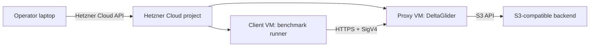

# Compression tax benchmark

This benchmark measures the operator-facing cost of enabling DeltaGlider
compression and proxy-side encryption.

It does **not** try to prove "compression is good" in the abstract. It answers:

- How much slower are uploads when xdelta3 is enabled?
- How much slower are cold and warm downloads?
- How much overhead does proxy-side AES-256-GCM add?
- How do those costs compare to the stored-byte reduction?

## Primary scenario

Use a CI artifact publishing workflow inside Hetzner Cloud:



The main measurement should be Hetzner-local. Do not use home internet as the
primary result; home-to-Hetzner measures ISP and WAN jitter.

## What is tested

The same dataset is run through four modes:

| Mode | Compression | Proxy AES-GCM | Purpose |
|---|---:|---:|---|
| `passthrough` | off | off | Proxy baseline |
| `compression` | on | off | xdelta3 tax |
| `encryption` | off | on | local-key encryption tax |
| `compression_encryption` | on | on | regulated / cheap-S3 mode |

Use the same backend for every mode. Create separate buckets for the modes and
configure their policies/backends accordingly.

## Dataset

The primary dataset is real public artifacts, not generated random data.

Default runner behavior fetches recent Linux kernel source archives from
`cdn.kernel.org`:

```text
linux-6.x.y.tar.xz
```

`.xz` is measured empirically. Do not assume it is a bad input. xdelta3 can
still perform well on compressed binary streams when the compressor output is
deterministic and adjacent versions remain binary-similar.

Recommended shape:

- 20-50 artifacts
- 100-300 MB each
- same prefix/deltaspace
- 2-10 GB total original bytes

## Install

On the machine that will orchestrate the benchmark:

```bash
python3 -m venv .venv-dgp-bench
. .venv-dgp-bench/bin/activate
pip install -r docs/benchmark/requirements.txt
```

The runner itself uses only stdlib for S3/SigV4 operations. The `hcloud`
dependency is needed only for `up`, `status`, and `down`.

The executable entrypoint is intentionally tiny:

```text
docs/benchmark/bench_production_tax.py
```

Most implementation lives in `docs/benchmark/dgp_bench/`:

- `cli.py` — command routing and argument parsing
- `hcloud_lifecycle.py` — Hetzner Cloud resource lifecycle
- `sigv4.py` — small S3 SigV4 client
- `artifacts.py` — real artifact discovery/download
- `runner.py` — PUT/cold GET/warm GET benchmark phases
- `metrics.py` — `/metrics`, `/_/stats`, and restart snapshots
- `reporting.py` — CSV/JSON/Markdown summaries

## Hetzner Cloud lifecycle

Set an API token:

```bash
export HCLOUD_TOKEN=...
```

Create the VMs:

```bash
python docs/benchmark/bench_production_tax.py up \
  --run-id dgp-tax-001 \
  --location fsn1 \
  --client-type cpx31 \
  --proxy-type cpx31 \
  --ssh-key-name your-hcloud-ssh-key
```

For smoke/debug work, create a single all-in-one VM instead:

```bash
python docs/benchmark/bench_production_tax.py up \
  --run-id dgp-tax-smoke \
  --single-vm \
  --location fsn1 \
  --client-type cpx31 \
  --ssh-key-name your-hcloud-ssh-key
```

Use this to verify package installation, artifact fetching, credentials,
bucket setup, and benchmark CLI behavior before paying for a full two-VM run.
Do not publish single-VM numbers as the primary benchmark: client, proxy, and
backend-local work can contend for CPU, memory, disk, and loopback networking.

Run the full single-VM smoke benchmark after the VM is ready:

```bash
python docs/benchmark/bench_production_tax.py single-vm-smoke \
  --run-id dgp-tax-smoke \
  --artifact-count 2 \
  --artifact-extension .tar.gz \
  --concurrency 1
```

This command SSHes into the single VM, starts a local DeltaGlider Docker
container with four mode buckets, downloads real kernel artifacts, runs the
four benchmark modes, and downloads a result bundle to
`docs/benchmark/results/`. It is a correctness/debug workflow, not the
publishable production benchmark.

The single-VM smoke defaults to `.tar.gz` real kernel artifacts because that
extension exercises the current delta-eligible path. The primary production
benchmark can still use `.tar.xz` via `--artifact-extension .tar.xz` to measure
that format empirically.

Inspect resources:

```bash
python docs/benchmark/bench_production_tax.py status --run-id dgp-tax-001
```

Destroy resources:

```bash
python docs/benchmark/bench_production_tax.py down --run-id dgp-tax-001
```

All created servers are labeled:

```text
app=dgp-compression-tax-bench
run=<run-id>
```

Use `--dry-run` on `down` before deleting.

## Configure DeltaGlider modes

Create four buckets:

```text
bench-passthrough
bench-compression
bench-encryption
bench-compression-encryption
```

Configure:

- `bench-passthrough`: compression off, encryption off.
- `bench-compression`: compression on, encryption off.
- `bench-encryption`: compression off, backend routed to `aes256-gcm-proxy`.
- `bench-compression-encryption`: compression on, backend routed to `aes256-gcm-proxy`.

The runner assumes these default bucket names. Override with:

```bash
--mode-bucket passthrough=my-bucket
--mode-bucket compression=my-bucket
--mode-bucket encryption=my-bucket
--mode-bucket compression_encryption=my-bucket
```

## Prepare artifacts

```bash
python docs/benchmark/bench_production_tax.py artifacts \
  --artifact-count 20 \
  --artifact-extension .tar.xz \
  --data-dir /data/dgp-bench/artifacts
```

This writes:

```text
/data/dgp-bench/artifacts/manifest.json
```

Every downloaded artifact gets a SHA-256 digest. GET results are verified
against that digest.

## Run benchmark

```bash
export DGP_BENCH_ACCESS_KEY=...
export DGP_BENCH_SECRET_KEY=...

python docs/benchmark/bench_production_tax.py run \
  --run-id dgp-tax-001 \
  --proxy-endpoint https://dgp.example.com \
  --region us-east-1 \
  --data-dir /data/dgp-bench/artifacts \
  --reuse-artifacts \
  --artifact-count 20 \
  --artifact-extension .tar.xz \
  --concurrency 1,4 \
  --metrics-url https://dgp.example.com/_/metrics \
  --stats-url https://dgp.example.com/_/stats \
  --health-url https://dgp.example.com/_/health \
  --results /data/dgp-bench/results
```

If you can safely clear cache/restart the proxy before cold GET phases, pass:

```bash
--restart-command 'ssh root@PROXY_IP systemctl restart deltaglider-proxy'
```

Do not use a restart command against a shared production instance.

## Output

Each run produces:

```text
results/<run-id>/
  artifacts.json
  environment.json
  summary.json
  report.md
  <mode>/c<concurrency>/
    put.csv
    cold_get.csv
    warm_get.csv
    before_*.json
    before_*.prom
    after_*.json
    after_*.prom
```

The report intentionally separates:

- speed tax
- cold GET tax
- warm GET tax
- storage ratio

Use [report-template.md](report-template.md) when publishing results.

## Interpreting results

The useful sentence is:

```text
Compression + encryption: PUT 0.50x, warm GET 0.82x, stored/original 0.09x.
Strong fit when using cheap/untrusted storage for retained artifacts.
```

Also publish the negative cases. If `.tar.xz` does not delta well, that is an
important operator result; it means workload structure matters more than the
file extension.

## Guardrails

- Use isolated buckets or an isolated prefix.
- Use a unique `--run-id`.
- Do not benchmark against a shared production prefix.
- Keep raw artifacts out of git.
- Do not publish credentials, bucket secrets, or unredacted host metadata.
