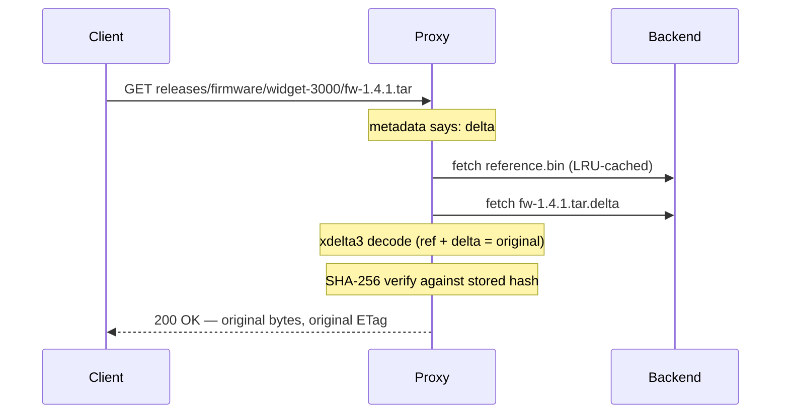

# How delta compression works

*Why storing every version of a binary is mostly waste, and what the proxy does about it.*

Picture the `releases` bucket at a firmware shop. A CI pipeline, authenticated as `ci-uploader`, pushes `firmware/widget-3000/fw-1.4.0.tar`, then `fw-1.4.1.tar` a week later, then `fw-1.4.2.tar`. Each tarball is tens of megabytes, and each is almost identical to the one before it. Between two versions, only a few source files, a version string and a build timestamp change. Standard S3 stores every byte of every version. DeltaGlider removes that waste, and the client never finds out.

## The core idea

The proxy stores the *difference* between versions instead of the versions themselves. The first delta-eligible upload into a prefix becomes the **reference baseline** for that prefix. The proxy runs every later upload through xdelta3 (a binary diff tool) against that baseline. If the diff is small enough, the proxy stores only the diff.

So when `ci-uploader` pushes `fw-1.4.0.tar`, the proxy keeps it in full as the reference. When `fw-1.4.1.tar` arrives, xdelta3 compares it against the reference and produces a delta of perhaps 60 KB, which holds the changed bytes plus bookkeeping. The proxy writes that 60 KB to storage. The client uploaded a full tarball and will download a full tarball, but the proxy stored less than one percent of it.


Two design choices matter here. First, the proxy computes every delta directly against the reference, and never against the previous delta. There are no delta chains, so reconstructing any version is always a single decode, and a corrupt delta can never cascade into its neighbours. Second, the baseline is per-prefix, not per-bucket. We call the unit a **deltaspace**: everything sharing the key prefix up to the last `/`. `firmware/widget-3000/` is one deltaspace with one `reference.bin`; `firmware/widget-9000/` would be another. This works because similar binaries tend to live together. A CI pipeline writes versions of the same artifact into the same folder. A bucket-wide baseline would force unrelated objects to diff against each other, and that produces useless deltas. A per-prefix baseline keeps the comparison local, where the similarity is. It also limits the damage of a bad reference to one folder.

## The PUT decision

Not everything should be delta-encoded, and the proxy decides per object. The file router looks at the extension first: archives, database dumps, tarballs, and similar version-prone formats are delta candidates; images, video, and other already-compressed media go straight to **passthrough** storage. A binary diff of a JPEG gains nothing, because compression already removed the redundancy that the diff would use.

Two settings also skip the delta for an eligible file. A bucket with `compression: false` stores every object passthrough. A single upload can carry the user metadata `x-amz-meta-dg-no-delta: true` (the `--no-delta` flag of the `deltaglider_proxy s3` verbs sets it), and the proxy then stores that object passthrough and does not keep the hint.

An eligible file also needs a delta that saves enough space. If the encoded delta comes out at 75% or more of the original size (the `max_delta_ratio` guard, tunable), the proxy discards it and stores the object passthrough instead. A delta that barely saves space isn't worth paying reconstruction CPU on every future read. This guard also catches misclassified files. You do not need a perfect extension list, because the proxy automatically stores any file that does not delta well as passthrough.

## The GET path, and why you can trust it

Reading a delta-stored object means rebuilding it:



The client sees an ordinary S3 response: the original `Content-Length`, the original ETag, preserved user metadata. This transparency is complete by design. The pipeline of `ci-uploader`, and anyone who downloads firmware, behave exactly as they would against plain S3.

An integrity check makes this transparency safe. On PUT, the proxy computes a SHA-256 of the original bytes and stores it in the object's metadata. On every delta GET, it recomputes the hash over the reconstructed bytes before sending anything. If the two hashes do not match (because of a corrupted delta, a corrupted reference or a cosmic ray), the proxy evicts the cached reference and returns a 500. You may get an error, but you never get silently wrong bytes.

## What compresses well, and what does not

The nightly Postgres dumps that `backup-bot` writes into `db-archive` are the ideal workload: large, structured, and mostly unchanged from one night to the next. Plain `.tar` archives of similar file trees are equally good. High-similarity workloads like these routinely see 60 to 95% savings.

Compressed archives need a more careful answer. A `.tar` of two similar source trees deltas very well. A `.tar.gz` of the *same* trees usually does not. Gzip compresses the whole stream as one continuous state machine, so a one-byte change early in the archive changes the state of the compressor and shifts the encoded bytes for everything after it. The payloads are similar; the compressed bytes are not, and xdelta3 can only see bytes. Container formats that compress each member independently (`.zip`, `.jar`, `.docx`) sit in between and often delta well. For example, a JAR where 20 of 500 classes changed still shares most of its compressed bytes with the previous build.

xdelta3 has a mode for whole-stream formats: it decompresses, diffs the payload, and recompresses on decode. We do not use it, on purpose. The recompressed file could carry the same data with different bytes and a different checksum, and the proxy's contract is byte-exact: what you GET is bit-for-bit what you PUT. The proxy treats a format that deltas well only after semantic recompression as a poor candidate, and stores it passthrough. The same applies to the public installers in `downloads` and to any content that is unique per upload. The ratio guard sends them to passthrough, and nobody has to configure anything.

## The trade-off: streaming versus buffering

Passthrough objects stream through the proxy in constant memory. Delta objects can't, because xdelta3 needs the whole reference as its source, and the proxy must verify the whole reconstruction before it sends the first byte. A delta object up to the spool threshold (`DGP_SPOOL_THRESHOLD_BYTES`, default 16 MiB, or `max_object_size` when that is smaller) is reconstructed in RAM. A larger delta object is reconstructed into a spool file in `DGP_SPOOL_DIR`, and the proxy streams that file to the client. The memory of that path stays small for any object size, but it uses disk space from the spool budget (`DGP_SPOOL_MAX_BYTES`). The verified file stays in the spool for `advanced.range_spool_ttl_secs` (default 60 seconds), so the range requests of a parallel downloader, and concurrent downloads of the same object, share one reconstruction. The reference that such a read downloads stays in the spool for the same time, after the proxy checks it against the SHA-256 that the delta names, so the other large delta reads of the deltaspace do not download it again. An upload of a delta-eligible object larger than the threshold is also encoded from a spool file. This is the price of the storage savings: delta reads cost CPU, and memory or spool space, that passthrough reads do not. The reference cache reduces this cost a lot. The baseline for a hot deltaspace stays in an LRU cache, so only the first cold read pays a backend round-trip. Cold reads that arrive at the same time wait for that one download. If your workload is huge objects that are stored once and read constantly, passthrough (or compression disabled on that bucket) is the better trade.

## What it looks like on the backend

The layout is the same on a filesystem backend and on an S3 backend, and it is simple on purpose:

```
releases/
  firmware/widget-3000/
    reference.bin            # internal baseline, seeded by fw-1.4.0.tar
    fw-1.4.1.tar.delta       # ~60 KB
    fw-1.4.2.tar.delta
    release-notes.txt        # passthrough, stored as-is
```

Per-object metadata (the SHA-256, sizes, which reference was used) travels with each object. The filesystem backend stores it as extended attributes, and the S3 backend stores it as S3 user-metadata headers. For this reason, there are no sidecar files to drift out of sync.

A listing needs one more fact on S3. An S3 `ListObjects` response reports only what the backend stores, so for `fw-1.4.1.tar` it reports the size and ETag of the 60 KB `.delta` object, and the original size lives in the user metadata that a listing does not return. A client such as a sync tool compares the listed size with the local file, so it would copy the object again on every run. For this reason, each upload that stores an object in another form (a delta, or ciphertext on a proxy-encrypted backend) also writes an empty index object under `.dg/facts/` in the same bucket. The key of that index object holds the stored object's key, ETag, and size, and the original size and ETag. A listing page reads these index objects with one more listing request, because their keys sort in the same order as the stored keys, and it reports the original facts. The proxy writes the index object in the background after the upload completes, so the upload does not wait for it. A listing on another proxy instance in that short time reports the stored size. An index object applies only to the stored object with exactly that key, ETag, and size, so the proxy ignores an index object that another upload made stale, and it does not give a wrong answer. A periodic cleanup on each instance deletes such stale index objects (`DGP_LISTING_FACTS_GC`). Listings never show the `.dg/facts/` objects, and every proxy instance reads them, also after a restart. An object that was stored before this index existed lists with its stored size until the proxy reads its metadata once (for example with a download or a `HEAD` request); the proxy then writes its index object.

## Why xdelta3, and why a subprocess

The codec shells out to the `xdelta3` binary rather than linking a library. This choice is deliberate. It guarantees byte-exact compatibility with deltas produced by the original DeltaGlider Python toolchain, keeps C code out of the Rust binary, and makes every delta trivially debuggable: any `.delta` file on the backend can be decoded by hand with stock `xdelta3` on any machine. The per-object subprocess overhead (tens of milliseconds) is small next to the network time of the upload itself.

## Related

- Tutorial: [Watch your first delta savings happen](../tutorials/first-delta-savings.md)
- How-to: [Set bucket compression and quotas](../how-to/set-bucket-compression-and-quotas.md)
- Reference: [Configuration](../reference/configuration.md) · [Metrics](../reference/metrics.md)
