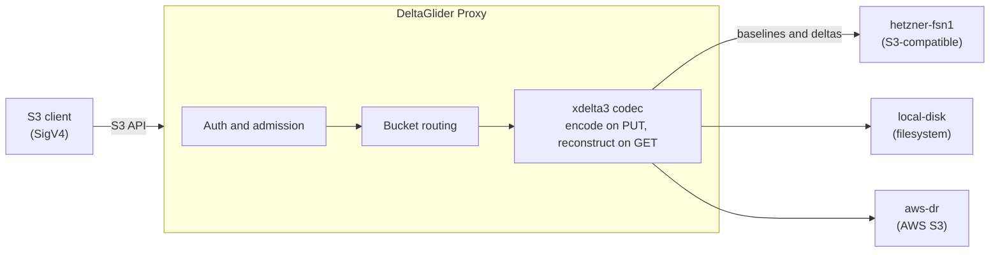

# About multi-backend routing

*Why the proxy is a control plane over your storage, not another place your bytes live.*

A common first question is "does this replace S3 or proxy to it?" It proxies to it. DeltaGlider never terminates your data. It holds the routing table, the IAM database, and per-object metadata, and the bytes live on the backends that you point it at: AWS S3, any S3-compatible provider, or a local filesystem path. The control plane is in the proxy, and the data plane is in the backends. Everything else on this page follows from this design decision.

## The data path

Your client speaks the standard S3 API to the proxy. The proxy authenticates the request, decides whether the object is delta-eligible, runs xdelta3 if it is, and reads or writes the bytes on the backend that the bucket is routed to.

The diagram shows the data path. An S3 client sends S3 API requests, signed with SigV4, to the proxy. The proxy runs authentication and admission, routes the bucket to its backend, and runs the xdelta3 codec, which encodes on PUT and reconstructs on GET. It then reads and writes the baselines and the deltas on the backend: `hetzner-fsn1`, `local-disk` or `aws-dr`.

The control plane (IAM, routing table, per-object metadata, jobs) lives in the proxy, and the data plane (your bytes) lives on the backends. For the encode/reconstruct mechanics, see [how delta compression works](delta-compression.md). For the CPU/RAM cost of a proxy that actively rewrites payloads, see [capacity planning](../reference/capacity-planning.md).

## One endpoint over many backends

Consider how Acme runs it. Their admin, `dana`, registers three backends: `hetzner-fsn1` (cheap S3-compatible storage in Falkenstein), `local-disk` (a filesystem path on the proxy host), and `aws-dr` (an AWS bucket kept as a disaster-recovery target). She then routes buckets across them. `releases`, which holds the firmware artifacts that `ci-uploader` pushes, lives on `hetzner-fsn1`. `db-archive`, where `backup-bot` drops nightly Postgres dumps, is on `local-disk`. DR copies replicate to `aws-dr`.

Neither `ci-uploader` nor `backup-bot` knows any of this. Both talk to the same endpoint, on the same port, with the same SigV4 credentials. The Engineering group's permissions are expressed against bucket names, not backends. You run the binary and point your S3 clients at it. The question of *where bytes physically land* then becomes an operator decision that you make in one place, and not a setting in every client config. The proxy serves the S3 API and the admin UI on a single port, and it works behind an ALB or any reverse proxy. It treats a directory on disk as a first-class backend. For this reason, "start on local disk, graduate to S3" is a routing change for your clients, not a migration project.

## Aliasing as decoupling

A virtual bucket name doesn't have to match the upstream bucket name. `releases` might map to a bucket called `acme-prod-releases-fsn1` on Hetzner. Provider-mandated naming, region suffixes, and legacy conventions stay on the backend side.

The virtual name is a stable contract with your clients, and you can change the mapping behind it. When Acme decides Hetzner pricing no longer justifies the latency, `dana` runs the built-in migrate job: the proxy copies `releases` to the new backend, verifies, and flips the route. CI pipelines, download scripts, and Terraform state do not notice, because none of them knew where the bytes were. Without aliasing, a provider move means that you must find every client that embeds the old endpoint. With aliasing, the move is a routine task.

## Why replication lives in the proxy

A cheap alternative is `aws s3 sync` or rclone in a cron job, which copies from one backend to another behind the back of the proxy. This alternative is worse than it looks, for three reasons.

First, it bypasses the engine. Objects on the backend are deltas and ciphertext. A plain byte copier would replicate `fw-1.4.1.tar.delta` to a destination that has a different reference baseline (or none), and nothing could ever reconstruct those objects. Second, DeltaGlider's metadata doesn't survive the trip through tools that don't know about it. Third, storage-native replication (S3 CRR, rsync) can't cross encryption boundaries. If `hetzner-fsn1` and `aws-dr` use different proxy-side keys, no backend-level copy can be valid on the other side. The remaining option, having every client dual-write, pushes the problem onto the people least equipped to own it.

For this reason, replication runs at the engine seam. The proxy GETs the object from the source as plaintext (reconstructed, decrypted, and verified) and PUTs it to the destination through the same pipeline as any client write. Each side independently decides whether to delta-compress and which encryption to apply. `aws-dr` can hold the same logical objects under a different key, with deltas computed against its own baselines. Replication is a durable job and not a shell script. It survives restarts mid-run, keeps run and failure history, and you can pause it. So you can audit the copy, and you do not have to hope that it happened.

## HA and the config-sync trade-off

The proxy process is stateless about object data, so horizontal scaling is mostly simple: run several instances against the same backends. Three pieces of state are shared, all through a designated S3 sync bucket. The first is the encrypted IAM database. After every mutation, the instance uploads the encrypted DB, and the other instances poll every five minutes and merge the copy when its ETag changes. Every instance must use the same database key (`DGP_CONFIG_DB_KEY`). Replication leadership is the second: each rule's leader holds an S3 conditional-write lease in the same bucket, so a dead leader fails over to a peer automatically instead of two instances double-running the rule. The third is a short-lived lock per deltaspace, which an instance holds while it creates or replaces a `reference.bin` baseline, so two instances never write two baselines for one prefix. Because the leases depend on atomic conditional writes, the proxy probes the bucket's backend at boot and refuses to start on one that silently ignores them.

This design is a merge with a polling lag, and we chose it on purpose. Each instance keeps the copy that it last shared with the bucket, and it uses that copy as the base of a three-way merge that matches rows by name. A change that only one instance made survives, and a delete on one instance deletes the row on every instance. IAM mutations are rare, operator-driven events. Consensus machinery for them would solve a problem that this deployment shape does not have. The design has limits. When two admins change the same field of the same user on different instances inside the same window, the more recent change wins and the proxy writes an `iam_sync_conflict` audit entry. A freshly created credential takes up to five minutes to work on other instances unless you force a pull. Also, sync is replication, not backup. A bad mutation propagates to every reader, so take point-in-time Full Backups as well.

## Trusting cheap storage

Because of the control-plane split, the backend needs to be only a simple, durable byte store. Everything that requires trust happens in the proxy. With proxy-side AES-256-GCM on `hetzner-fsn1`, the provider stores ciphertext and the key never leaves your runtime; compression runs before encryption, so the savings survive. SHA-256 verification on reconstructed reads means backend bit-rot surfaces as an error, never as corrupt data. One caveat: object names, sizes, and user metadata stay visible to the backend. Keep secrets in object bodies, not in key names. Within that boundary, the cheapest S3-compatible storage you can find is exactly as trustworthy as the proxy in front of it. There is also a capability caveat. Some cheap backends (Backblaze B2, for example) do not enforce conditional writes, and multi-instance deployments need them for safe concurrent client writes. The proxy validates this at startup and refuses unsafe combinations. To use such a bucket as a mirror anyway, mark it `replication_target_only`. See [How to use a backend without conditional writes](../how-to/backend-capability-validation.md).

## Related

- How-to: [Route a bucket to a backend](../how-to/route-a-bucket-to-a-backend.md)
- How-to: [Run multiple instances](../how-to/run-multiple-instances.md)
- Reference: [Configuration](../reference/configuration.md)
