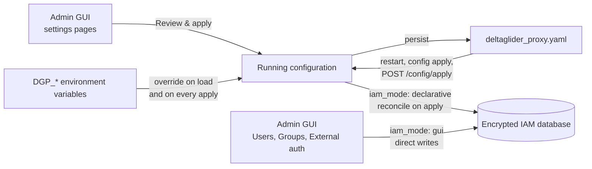

# Two ways to configure DeltaGlider

*Why the admin GUI and the YAML file are two editors of one configuration, where environment variables fit in, and why IAM is the exception.*

Most task guides show a change twice: first as steps in the admin UI, then as the same change in YAML. This page explains why both forms exist, how they stay in step, and how to choose between them.

## One configuration, two editors

The proxy keeps one configuration in memory. It has four sections: `admission`, `access`, `storage` and `advanced`. The YAML file, which is usually `deltaglider_proxy.yaml`, holds this configuration on disk in the same four sections. The admin GUI at `/_/admin/` reads and changes the same configuration. Neither of them is a copy of the other, because both edit one document.

When you change a setting in the GUI, the page does not write anything at once. It marks the section as changed and shows a bar with a **Review & apply** button. That button sends the changed section to the server for validation, and the server answers with a diff. The dialog shows that diff, and **Apply and Persist** then does two things. First, it swaps the running configuration, so the change takes effect without a restart. Second, it writes the whole configuration back to the config file as canonical sectioned YAML. The write is atomic: the proxy writes a temporary file and renames it over the old one.

The file that the proxy writes is the file that it loaded at startup. When `DGP_CONFIG` is set, that is the path in `DGP_CONFIG`. When the proxy started without a config file, it writes `./deltaglider_proxy.yaml` in its working directory. The [configuration reference](../reference/configuration.md#config-file-search-order) lists the full search order.

When you edit the file instead, the running proxy does not notice the edit by itself. You apply the file in one of three ways:

- Restart the proxy, which reads the file again.
- Send the whole document to `POST /_/api/admin/config/apply`, or paste it into **Import settings YAML** in the account menu of the admin UI.
- Run `deltaglider_proxy config apply deltaglider_proxy.yaml --server https://s3.acme.example` from your workstation or from CI. The CLI signs in with the bootstrap password from `DGP_BOOTSTRAP_PASSWORD` and sends the document to the same endpoint.

The apply endpoint and the GUI use the same validation and the same write path. An apply that fails validation changes nothing. An apply that succeeds is persisted to the config file in the same way as a GUI change.

Most settings take effect at once. Four settings are read only at startup: `listen_addr`, `cache_size_mb`, the TLS settings, and `config_sync_bucket`. When an apply changes one of them, the proxy stores the new value, and the dialog or the API response says that a restart is required.

## Environment variables sit on top

Every `DGP_*` environment variable that the proxy knows overrides the matching field of the file. The proxy applies these overrides when it loads the file at startup, and again after every apply. A value that you type into the GUI therefore cannot beat an environment variable, because the next apply or the next restart puts the environment value back.

The GUI shows this rule instead of hiding it. A field that an environment variable controls is read-only, and it carries a "from env" badge with the name of the variable. The server reports these fields in `GET /_/api/admin/config` as `env_overrides`. For a secret, the report names the variable but never includes its value.

An environment value never reaches the config file. When the proxy persists the configuration, it puts the value from the file back into every field that an environment variable controls. The export does the same, so an exported document shows what the file says, not what the environment says.

A `${env:NAME}` reference inside the file is a different mechanism. The proxy replaces the reference with the value of `NAME` when it loads the file, and it records which fields came from which variable. When the proxy writes the file or exports it, it writes `${env:NAME}` back into those fields. A secret that you keep in the environment, such as the secret key of a backend, therefore stays a reference through every GUI change:

```yaml
storage:
  backends:
    - name: hetzner-fsn1
      type: s3
      endpoint: https://fsn1.your-objectstorage.com
      region: fsn1
      force_path_style: true
      access_key_id: "${env:HETZNER_S3_KEY}"
      secret_access_key: "${env:HETZNER_S3_SECRET}"
```

## What a restart reads

At startup, the proxy reads the configuration in this order:

1. It finds the config file, and it replaces every `${env:NAME}` reference with the value of the variable. A reference to an unset variable without a default stops the startup with an error.
2. It applies the `DGP_*` environment variables on top of the file.
3. It opens the encrypted config database, `deltaglider_config.db`, which sits next to the config file and holds the IAM state.

A GUI change that the proxy persisted is in the file, so a restart keeps it. A GUI change that the proxy could not persist is lost at the restart. This happens when the config file is read-only. The Helm chart and the Kubernetes operator both mount the config file read-only from a ConfigMap, so on Kubernetes a GUI change lives only until the pod restarts. In that case the server answers that it applied the change in memory but failed to persist it, and that it will revert at the next restart.

## IAM is the exception

Users, groups, OAuth providers and group-mapping rules do not live in the config file by default. They live in the encrypted config database, and the setting `access.iam_mode` decides who owns them.

With `iam_mode: gui`, which is the default, the database is the source of truth. You create and change users and groups on the **Users**, **Groups** and **External authentication** pages, and each change goes straight to the database. These pages have no **Review & apply** step. An export of the settings does not include the users, which is why the Users page says that users live in the encrypted database and not in YAML. To copy the IAM state, use **Export full IAM (YAML)** in the account menu, or a full backup.

With `iam_mode: declarative`, the YAML file is the source of truth. You list users under `access.iam_users`, groups under `access.iam_groups`, and providers and rules next to them. On every apply, a reconciler compares the YAML with the database by name, validates the whole set, and then creates, updates and deletes rows in one database transaction. If validation fails, the database does not change. Because names and not ids identify the rows, a user keeps its database id when you rotate its access key. The IAM pages of the GUI become read-only and say that the YAML config owns the users, and the admin API refuses IAM changes with `403 iam_declarative`.

In declarative mode, the `access` section of the file carries the IAM state next to the mode switch. This fragment declares the Engineering group, which may read and list the releases bucket:

```yaml
# validate
access:
  iam_mode: declarative
  iam_groups:
    - name: Engineering
      description: "Read-only access to releases"
      permissions:
        - effect: Allow
          actions: ["read", "list"]
          resources: ["releases/*"]
```

The proxy also reconciles at startup in declarative mode, with one guard. A startup reconcile that would delete users, groups or providers stops the startup instead, because a destructive change must go through an attended `config apply` and not happen silently on a restart. The first switch from `gui` to `declarative` has a similar guard: an apply that switches the mode with no users or groups in the YAML is refused, so that it cannot empty a populated database. [How to manage IAM as code](../how-to/manage-iam-as-code.md) walks through the switch.



## When to use which

The GUI suits one instance that a person looks after by hand. You see the current value of each field, the diff before each change, and the validation errors before anything changes. The file stays current, because every apply writes it.

The YAML file suits configuration as code: a Git repository, a CI pipeline, a Helm chart, or the Kubernetes operator. The file in the repository is the reviewed source, and `config apply` or a restart puts it in place. On Kubernetes, where the mounted file is read-only, the YAML in the chart values or the `DeltaGliderProxy` resource is the only change that survives a pod restart. If you also want IAM in the repository, set `iam_mode: declarative`.

The two ways also combine. Many operators start with the GUI and move to a file later. Others keep the file in Git and use the GUI to try a change before they commit it.

## The round trip

A GUI change can go back into your repository without any retyping:

1. Make the change in the GUI and apply it with **Review & apply**.
2. Open the account menu in the page header and select **Export settings YAML**, or send `GET /_/api/admin/config/export`. Add `?section=storage` to export one section.
3. Commit the exported document, and apply it from the repository from then on.

The export removes every secret, for example the secret keys of the bootstrap credentials and of each backend, the encryption keys, the bootstrap password hash, and the values of webhook headers. It keeps the access key ids, because the operator must see which key is configured, and it keeps every `${env:NAME}` reference, because a reference is not a secret. When you apply the exported document again, the proxy fills each missing secret from the running configuration, so an export, edit and apply cycle does not clear a credential. **Export full IAM (YAML)** is different: it includes live secrets, so handle its output like a password file.

## Related

- [Configuration reference](../reference/configuration.md): every YAML field and every environment variable.
- [Declarative IAM reference](../reference/declarative-iam.md): the YAML shape of users, groups and providers.
- [How to manage IAM as code](../how-to/manage-iam-as-code.md): switch IAM to declarative mode.
- [Admin API reference](../reference/admin-api.md): `config/export`, `config/apply` and the section endpoints.
