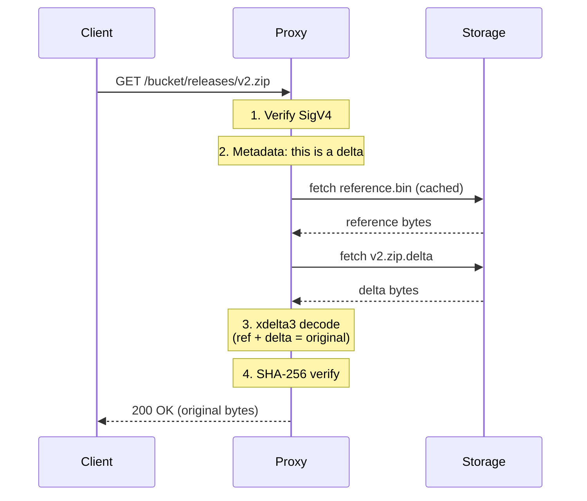

# How delta compression works

*On-disk layout, PUT/GET flow, and integrity guarantees — the short version.*

This page is operational-depth reference: enough to debug "why is this file stored as passthrough?" or "what does my bucket actually contain?" without diving into the Rust code.

## PUT flow (one line)

The proxy's `FileRouter` looks at the extension. Eligible types (archives, backups, db dumps) go through delta encoding against the deltaspace's `reference.bin`; other types are stored passthrough.

If `delta_size / original_size ≥ max_delta_ratio` (default 0.75), the proxy falls back to passthrough — the delta didn't save enough to be worth the CPU on read.

## GET flow



The client sees standard S3 headers — original `Content-Length`, ETag of the original file, preserved `x-amz-meta-*` user metadata. The only hint delta compression happened is the debug header `x-amz-storage-type: delta` (hidden by default; enable with `DGP_DEBUG_HEADERS=true`).

## Streaming vs buffering

| Storage type | Memory | Behaviour |
|---|---|---|
| **Passthrough** | Constant (chunked) | Streamed directly — zero-copy |
| **Delta** | `O(file_size)` | Buffered — xdelta3 is a batch algorithm |
| **Reference** | `O(file_size)` | Buffered (same as delta) |

`DGP_MAX_OBJECT_SIZE` (default 100 MB) caps the memory used for reconstruction. The reference is held in an LRU cache (`DGP_CACHE_MB`, default 100 MB — bump to 1024+ in production) so hot reads skip the backend fetch.

## Integrity

Every delta-reconstructed file is SHA-256 verified before being returned to the client:

1. On **PUT**: SHA-256 is computed on the original bytes and stored in metadata.
2. On **GET**: SHA-256 is recomputed on the reconstructed bytes.
3. On **mismatch**: the cached reference is evicted and the client gets `500 InternalError` — never corrupt data.

Passthrough files are streamed directly (no buffered hash — incompatible with constant-memory streaming). Storage-level integrity (filesystem checksums, S3's built-in) protects those.

## Deltaspaces

A **deltaspace** is everything sharing the key prefix up to the last `/`. Each deltaspace has one `reference.bin`:

```
releases/v1.zip          ── deltaspace: "releases/"
releases/v2.zip          ── same deltaspace, delta against releases/reference.bin
releases/nested/v3.zip   ── deltaspace: "releases/nested/"
top-level.zip            ── deltaspace: "" (root)
```

The reference is seeded from the **first delta-eligible upload** in that deltaspace. Every subsequent delta is computed directly against the reference — there are no delta chains, so a single corrupt delta can't cascade.

Root-level keys (no `/` in the key) use an empty deltaspace id and live in the deltaspaces root.

## Filesystem layout

Everything lives under `DGP_DATA_DIR`:

```
data/
  deltaspaces/
    releases/
      reference.bin              # internal baseline, not a user-visible key
      v1.zip.delta               # delta patch
      readme.txt                 # passthrough, stored with original filename
    reference.bin                # root-level deltaspace
    file.zip.delta
```

Nested prefixes become nested directories.

### Metadata storage (xattr)

On the filesystem backend, metadata is a `user.dg.metadata` extended attribute on each data file's inode — no sidecar `.meta` files, halving inode usage.

**Filesystem requirement:** ext4, XFS, Btrfs, ZFS, or APFS. The proxy validates xattr support at startup and **refuses to start** if the filesystem doesn't support them.

Inspect:

```bash
# macOS
xattr -p user.dg.metadata data/deltaspaces/releases/v1.zip.delta

# Linux
getfattr -n user.dg.metadata --only-values data/deltaspaces/releases/v1.zip.delta
```

## S3 backend layout

Each API bucket maps 1:1 to a real S3 bucket. Artefacts use the same naming as the filesystem backend:

```
releases/reference.bin
releases/v1.zip.delta
releases/readme.txt              # passthrough
```

Metadata travels as S3 user-metadata headers (`x-amz-meta-dg-*`) on each object. No sidecar files.

## Metadata schema

Metadata is JSON-serialised from `crate::types::FileMetadata`. The interesting fields:

**All entries:** `tool`, `original_name`, `file_sha256`, `file_size`, `md5`, `created_at`, `content_type`.

**When `note = "delta"`:** `ref_key`, `ref_sha256`, `delta_size`, `delta_cmd`.

**When `note = "passthrough"`:** no extra fields — stored as-is with original filename.

**When `note = "reference"`:** internal baseline; `source_name` records the user key that seeded it.

## Presigned URLs

Presigned GET URLs work identically. The proxy verifies the presigned signature (including expiry, capped at 7 days to match AWS), then handles reconstruction internally. The signed URL never reaches the backend — the proxy makes its own authenticated request to storage.

Full presigned URL flow: [reference/authentication.md](authentication.md).
